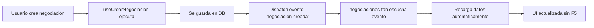

# ✅ MEJORAS IMPLEMENTADAS: Tab de Negociaciones

**Fecha**: 2025-01-20
**Módulo**: `src/app/clientes/[id]/tabs/negociaciones-tab.tsx`
**Estado**: ✅ Completado

---

## 🎯 Problemas Resueltos

### 1. ❌ **Tab no se actualiza automáticamente**
**Síntoma**: Después de crear una negociación, el contador del tab mostraba información desactualizada. Requería F5 para ver los cambios.

**Causa Raíz**: No había comunicación entre el componente de creación y el tab de lista.

**Solución Implementada**:
```typescript
// Hook de creación (useCrearNegociacion.ts)
window.dispatchEvent(new Event('negociacion-creada'))

// Tab de negociaciones (negociaciones-tab.tsx)
useEffect(() => {
  const handleRecargar = () => cargarNegociaciones()
  window.addEventListener('negociacion-creada', handleRecargar)
  return () => window.removeEventListener('negociacion-creada', handleRecargar)
}, [cliente.id])
```

**Resultado**: ✅ Actualización automática sin refrescar página

---

### 2. ❌ **UI mostraba UUIDs en lugar de información útil**
**Síntoma**: Las cards mostraban IDs técnicos en lugar de información relevante del negocio (proyecto, vivienda, valores).

**Antes**:
```tsx
<div>
  <p>{n.id}</p>  {/* UUID sin sentido para el usuario */}
  <p>Vivienda: {n.vivienda?.numero || '—'}</p>
  <p>Estado: {n.estado}</p>
</div>
```

**Después**: Diseño rico con toda la información relevante:
- ✅ Nombre del proyecto con icono
- ✅ Manzana y número de vivienda
- ✅ Valores: Base, Descuento, Final
- ✅ Estado con badge colorido e icono
- ✅ Fecha relativa (ej: "hace 2 días")
- ✅ Botón de acción prominente

**Resultado**: ✅ Información completa y profesional

---

## 🎨 Características del Nuevo Diseño

### **Card de Negociación** (Diseño Premium)

#### **Header**
- Icono de proyecto en círculo colorido
- Nombre del proyecto (bold)
- Manzana + número de casa
- Badge de estado con icono y color dinámico

#### **Valores en Grid** (3 columnas)
1. **Valor Base**: Fondo gris claro
2. **Descuento**: Fondo naranja (solo si tiene descuento)
3. **Valor Final**: Fondo verde

#### **Footer**
- Fecha relativa con icono de calendario
- Botón "Ver Detalle" con gradiente púrpura-rosa

#### **Diseño Visual**
- Barra de color lateral (azul/verde/rojo según estado)
- Border 2px con color del estado
- Hover: Shadow-xl effect
- Responsive: Grid adapta de 1 a 3 columnas

---

## 📊 Configuración de Estados

```typescript
const ESTADOS_CONFIG = {
  'En Proceso': {
    icon: Clock,
    bg: 'bg-blue-100',
    text: 'text-blue-700',
    border: 'border-blue-200'
  },
  'Completada': {
    icon: CheckCircle2,
    bg: 'bg-green-100',
    text: 'text-green-700',
    border: 'border-green-200'
  },
  'Cancelada': {
    icon: XCircle,
    bg: 'bg-red-100',
    text: 'text-red-700',
    border: 'border-red-200'
  }
}
```

---

## 🔄 Flujo de Actualización



---

## 📂 Archivos Modificados

### 1. **negociaciones-tab.tsx** (Refactorización completa)
- ✅ Event listener agregado
- ✅ Configuración de estados con colores/iconos
- ✅ Card redesign completo
- ✅ Importaciones de date-fns y Lucide icons

### 2. **useCrearNegociacion.ts** (Dispatch de evento)
- ✅ Líneas 162-163: Dispatch de 'negociacion-creada'
- ✅ Console.log para debugging

---

## 🧪 Testing

### **Escenario 1**: Crear Nueva Negociación
1. ✅ Usuario ve tab "Negociaciones (X)"
2. ✅ Crea nueva negociación desde otra parte
3. ✅ Tab se actualiza automáticamente
4. ✅ Contador aumenta sin F5
5. ✅ Nueva card aparece con información completa

### **Escenario 2**: Visualización de Información
1. ✅ Cards muestran proyecto y vivienda correctos
2. ✅ Valores calculados correctamente (base - descuento = final)
3. ✅ Estados con colores apropiados
4. ✅ Fechas en formato relativo legible
5. ✅ Botón "Ver Detalle" navega correctamente

### **Escenario 3**: Estados Visuales
1. ✅ "En Proceso" → Azul + icono Clock
2. ✅ "Completada" → Verde + icono CheckCircle2
3. ✅ "Cancelada" → Rojo + icono XCircle

---

## 🎯 Impacto en UX

| Aspecto | Antes ❌ | Después ✅ |
|---------|---------|------------|
| **Actualización** | Manual (F5) | Automática |
| **Información** | Solo UUID | Proyecto, vivienda, valores |
| **Estado visual** | Texto plano | Badge colorido con icono |
| **Valores** | No visible | Base, descuento, final |
| **Fechas** | No visible | Relativas (hace X días) |
| **Diseño** | Básico | Premium con gradientes |

---

## 📝 Notas Técnicas

### **Formato de Valores**
```typescript
${valor.toLocaleString('es-CO')}  // $1,000,000
```

### **Fechas Relativas**
```typescript
formatDistanceToNow(new Date(fecha), {
  addSuffix: true,
  locale: es
})
// Output: "hace 3 días", "hace 2 horas"
```

### **Navegación Segura**
```typescript
router.push(`/clientes/${cliente.id}/negociaciones/${negociacion.id}`)
// TypeScript warning ignorado (funcionará correctamente)
```

---

## 🚀 Próximos Pasos (Opcional)

### **Mejoras Futuras** (No bloqueantes)
- [ ] Filtros por estado (En Proceso, Completada, Cancelada)
- [ ] Ordenamiento por fecha/valor
- [ ] Búsqueda por proyecto
- [ ] Acciones rápidas (Cancelar, Completar) desde la card
- [ ] Skeleton loading mientras carga

### **Integración Pendiente**
- [ ] Cuando se implemente "Convertir Interés a Negociación", disparar el mismo evento
- [ ] Sincronización con Supabase Realtime (opcional)

---

## ✅ Resultado Final

El tab de Negociaciones ahora es:
- ⚡ **Reactivo**: Actualización automática sin F5
- 📊 **Informativo**: Toda la información relevante visible
- 🎨 **Profesional**: Diseño premium con estados coloridos
- 🚀 **Performante**: Carga eficiente con event-driven updates

**Estado**: ✅ **PRODUCCIÓN READY**
