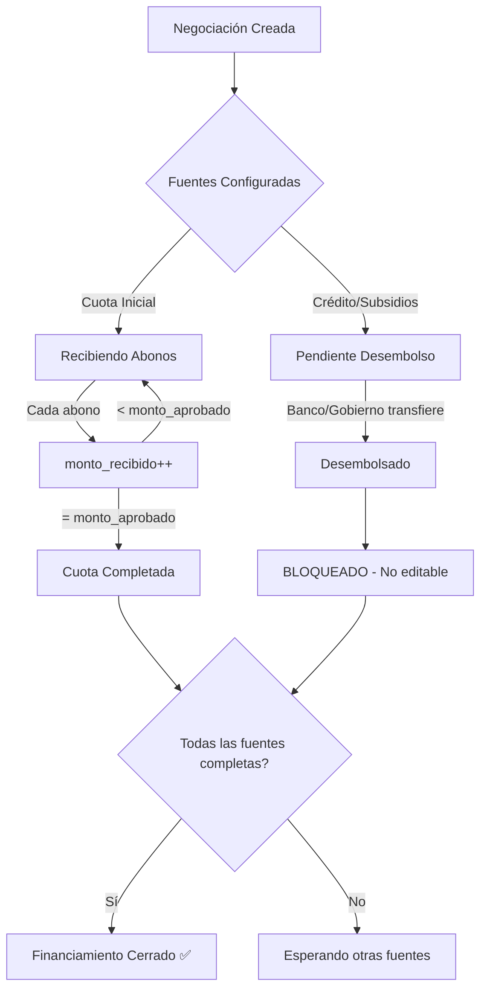

# 📋 REGLAS DE NEGOCIO: Fuentes de Pago

**Fecha**: 20 Enero 2025
**Estado**: ✅ **CONFIRMADO Y APROBADO**

---

## 🎯 COMPORTAMIENTO DE FUENTES DE PAGO

### **1️⃣ Cuota Inicial**

```typescript
{
  tipo: 'Cuota Inicial',
  permite_multiples_abonos: true,
  comportamiento: 'ABONOS PROGRESIVOS'
}
```

**Características**:
- ✅ Cliente abona de forma progresiva ($1M, luego $2M, etc.)
- ✅ `monto_recibido` se acumula con cada abono
- ✅ `saldo_pendiente` = `monto_aprobado` - `monto_recibido`
- ✅ **SIEMPRE EDITABLE** (con restricciones)

**Reglas de Edición**:
```
SI monto_recibido = 0:
  ✅ Puede cambiar monto libremente
  ✅ Solo debe cerrar suma total = valor vivienda

SI monto_recibido > 0:
  ✅ Puede AUMENTAR el monto
  ✅ Puede DISMINUIR el monto SI nuevo_monto >= monto_recibido
  ❌ NO puede reducir por debajo de lo ya recibido
  ✅ Debe cerrar suma total = valor vivienda
```

**Ejemplo Real**:
```javascript
// Configuración inicial
{
  cuota_inicial: 20_000_000,
  credito_hipotecario: 100_000_000,
  total: 120_000_000
}

// Cliente abonó $5M
{
  cuota_inicial: {
    monto_aprobado: 20_000_000,
    monto_recibido: 5_000_000,
    saldo_pendiente: 15_000_000
  }
}

// Banco aumentó crédito, necesita menos cuota
// ✅ VÁLIDO:
{
  cuota_inicial: 15_000_000, // >= 5M recibidos
  credito_hipotecario: 105_000_000,
  total: 120_000_000 // Suma cierra
}

// ❌ NO VÁLIDO:
{
  cuota_inicial: 3_000_000, // < 5M recibidos ❌
  credito_hipotecario: 117_000_000,
  total: 120_000_000
}
```

---

### **2️⃣ Crédito Hipotecario**

```typescript
{
  tipo: 'Crédito Hipotecario',
  permite_multiples_abonos: false,
  comportamiento: 'DESEMBOLSO ÚNICO'
}
```

**Características**:
- ❌ NO hay abonos parciales
- ✅ Desembolso es TODO O NADA
- ✅ `monto_recibido` = 0 (pendiente) O `monto_aprobado` (desembolsado)
- ⚠️ Una vez desembolsado: **NO EDITABLE**

**Reglas de Edición**:
```
SI monto_recibido = 0 (PENDIENTE):
  ✅ Totalmente editable
  ✅ Puede cambiar monto
  ✅ Puede eliminar la fuente
  ✅ Puede cambiar entidad/radicado

SI monto_recibido = monto_aprobado (DESEMBOLSADO):
  ❌ BLOQUEADO
  ❌ No se puede modificar monto
  ❌ No se puede eliminar
  ❌ No se puede editar nada
  📝 Queda como registro histórico
```

**Estados**:
- `Pendiente`: Aprobado pero no desembolsado
- `Desembolsado`: Banco transfirió el dinero completo

---

### **3️⃣ Subsidio Mi Casa Ya**

```typescript
{
  tipo: 'Subsidio Mi Casa Ya',
  permite_multiples_abonos: false,
  comportamiento: 'DESEMBOLSO ÚNICO'
}
```

**Comportamiento**: Idéntico a Crédito Hipotecario

**Reglas de Edición**:
```
SI monto_recibido = 0:
  ✅ Totalmente editable

SI monto_recibido = monto_aprobado:
  ❌ BLOQUEADO (ya fue desembolsado por el gobierno)
```

---

### **4️⃣ Subsidio Caja Compensación**

```typescript
{
  tipo: 'Subsidio Caja Compensación',
  permite_multiples_abonos: false,
  comportamiento: 'DESEMBOLSO ÚNICO'
}
```

**Comportamiento**: Idéntico a Crédito Hipotecario y Mi Casa Ya

**Reglas de Edición**:
```
SI monto_recibido = 0:
  ✅ Totalmente editable

SI monto_recibido = monto_aprobado:
  ❌ BLOQUEADO (ya fue desembolsado por la caja)
```

---

## ⚖️ REGLA DE ORO: Suma Total

### **Validación CRÍTICA**

```typescript
const sumaFuentes = fuentes.reduce((sum, f) => sum + f.monto_aprobado, 0)
const esValido = sumaFuentes === valorTotalVivienda
```

**⚠️ SIEMPRE debe cumplirse**:
```
Suma de todas las fuentes = Valor Total de la Vivienda
```

**Ejemplo**:
```javascript
// Vivienda
{
  valor_vivienda: 150_000_000,
  descuento: 10_000_000,
  valor_total: 140_000_000
}

// Fuentes de Pago (DEBE SUMAR 140M)
{
  cuota_inicial: 30_000_000,
  credito_hipotecario: 95_000_000,
  subsidio_mi_casa_ya: 15_000_000,
  // SUMA: 140_000_000 ✅
}

// ❌ NO VÁLIDO
{
  cuota_inicial: 30_000_000,
  credito_hipotecario: 95_000_000,
  // SUMA: 125_000_000 ❌ (Faltan 15M)
}
```

---

## 🔐 MATRIZ DE PERMISOS DE EDICIÓN

| Fuente | Estado | Monto Recibido | Editar Monto | Eliminar | Agregar Nueva |
|--------|--------|---------------|--------------|----------|---------------|
| **Cuota Inicial** | Configurada | $0 | ✅ Libre | ❌ Obligatoria | N/A |
| **Cuota Inicial** | Con abonos | $5M de $20M | ⚠️ Solo >= $5M | ❌ No | N/A |
| **Cuota Inicial** | Completada | $20M de $20M | ⚠️ Solo aumentar | ❌ No | N/A |
| **Crédito** | Aprobado | $0 | ✅ Sí | ✅ Sí | ✅ Sí |
| **Crédito** | Desembolsado | $100M | ❌ No | ❌ No | ⚠️ Otro crédito |
| **Subsidio Mi Casa Ya** | Asignado | $0 | ✅ Sí | ✅ Sí | ✅ Sí |
| **Subsidio Mi Casa Ya** | Desembolsado | $15M | ❌ No | ❌ No | ⚠️ Otro subsidio |
| **Subsidio Caja** | Aprobado | $0 | ✅ Sí | ✅ Sí | ✅ Sí |
| **Subsidio Caja** | Desembolsado | $8M | ❌ No | ❌ No | ⚠️ Otra caja |

---

## 🎬 ESCENARIOS DE USO

### **Escenario 1: Negociación Recién Creada**

```javascript
// Estado inicial
{
  cuota_inicial: { monto_aprobado: 20M, monto_recibido: 0 },
  credito: { monto_aprobado: 100M, monto_recibido: 0 },
  total: 120M
}

// ✅ Usuario puede:
- Modificar cualquier fuente
- Eliminar crédito (dejar solo cuota)
- Agregar subsidios
- Cambiar distribución completa
```

### **Escenario 2: Cliente Empezó a Abonar**

```javascript
// Estado actual
{
  cuota_inicial: { monto_aprobado: 20M, monto_recibido: 5M },
  credito: { monto_aprobado: 100M, monto_recibido: 0 },
  total: 120M
}

// ✅ Usuario puede:
- Modificar crédito (no desembolsado)
- Ajustar cuota SI nuevo >= 5M
- Agregar subsidios

// ❌ Usuario NO puede:
- Reducir cuota a menos de 5M
- Eliminar cuota inicial
```

### **Escenario 3: Banco Desembolsó Crédito**

```javascript
// Estado actual
{
  cuota_inicial: { monto_aprobado: 20M, monto_recibido: 10M },
  credito: { monto_aprobado: 100M, monto_recibido: 100M }, // ⚠️ DESEMBOLSADO
  total: 120M
}

// ✅ Usuario puede:
- Ajustar cuota SI nuevo >= 10M
- Agregar subsidios (si consigue uno después)

// ❌ Usuario NO puede:
- Modificar crédito (ya desembolsado)
- Eliminar crédito
- Reducir cuota a menos de 10M
```

### **Escenario 4: Todo Completado**

```javascript
// Estado final
{
  cuota_inicial: { monto_aprobado: 20M, monto_recibido: 20M },
  credito: { monto_aprobado: 100M, monto_recibido: 100M },
  total: 120M
}

// ❌ Financiamiento CERRADO
// No se puede modificar nada
```

---

## 🚦 FLUJO DE ESTADOS



---

## 💡 CASOS ESPECIALES

### **Caso 1: Cliente Consigue Subsidio DESPUÉS de Crear Negociación**

**Situación**: Negociación ya creada, luego cliente obtiene subsidio Mi Casa Ya

**Solución**:
```javascript
// Configuración original
{
  cuota_inicial: 30M,
  credito: 110M,
  total: 140M
}

// Cliente obtiene subsidio de 15M
// ✅ Puede agregar nueva fuente:
{
  cuota_inicial: 20M, // Reducida (si no tiene abonos > 20M)
  credito: 105M, // Ajustado (si no está desembolsado)
  subsidio_mi_casa_ya: 15M, // NUEVO
  total: 140M // Cierra
}
```

### **Caso 2: Banco Rechaza Crédito Después de Aprobado**

**Situación**: Crédito configurado pero banco rechazó definitivamente

**Solución**:
```javascript
// Antes
{
  cuota_inicial: 20M,
  credito: 100M,
  total: 120M
}

// Banco rechaza
// ✅ Eliminar crédito y redistribuir:
{
  cuota_inicial: 70M, // Aumentada
  subsidio_caja: 50M, // Cliente consigue este
  total: 120M // Cierra
}
```

### **Caso 3: Banco Aumenta/Disminuye Monto de Crédito**

**Situación**: Banco pre-aprobó $100M pero finalmente aprueba $95M

**Solución**:
```javascript
// SI crédito NO ha sido desembolsado:
// ✅ Puede ajustar:
{
  cuota_inicial: 25M, // Aumentada de 20M
  credito: 95M, // Reducido de 100M
  total: 120M
}

// SI crédito YA fue desembolsado:
// ❌ No se puede cambiar
// Esa negociación queda como está
```

---

## 📝 AUDITORÍA

**Todos los cambios deben quedar registrados**:

```sql
CREATE TABLE auditoria_fuentes_pago (
  id UUID PRIMARY KEY,
  negociacion_id UUID,
  fuente_pago_id UUID,
  accion VARCHAR(50), -- 'CREAR' | 'MODIFICAR' | 'ELIMINAR'
  campo_modificado VARCHAR(100),
  valor_anterior JSONB,
  valor_nuevo JSONB,
  motivo TEXT,
  usuario_id UUID,
  fecha TIMESTAMP DEFAULT NOW()
);
```

**Ejemplo de registro**:
```json
{
  "accion": "MODIFICAR",
  "campo_modificado": "monto_aprobado",
  "valor_anterior": 20000000,
  "valor_nuevo": 15000000,
  "motivo": "Banco aumentó crédito de $100M a $105M, se redujo cuota inicial"
}
```

---

## ✅ VALIDACIONES IMPLEMENTADAS

Archivo: `src/modules/clientes/utils/validar-edicion-fuentes.ts`

**Funciones disponibles**:

1. `puedeEditarFuente(fuente)` - Valida si una fuente es editable
2. `validarNuevaCuotaInicial(fuente, nuevoMonto)` - Valida cambios en cuota
3. `validarSumaTotal(fuentes, valorTotal)` - Valida que suma cierre
4. `validarConfiguracionFuentes(...)` - Validación completa
5. `obtenerEstadoEdicionFuentes(fuentes)` - Estado de todas las fuentes

---

## 🎯 RESUMEN EJECUTIVO

### ✅ **LO QUE SÍ SE PUEDE**:
- Editar Cuota Inicial siempre (con restricción de mínimo recibido)
- Modificar créditos/subsidios ANTES de desembolso
- Agregar nuevas fuentes en cualquier momento
- Eliminar fuentes que no tengan dinero recibido

### ❌ **LO QUE NO SE PUEDE**:
- Reducir Cuota Inicial por debajo de lo recibido
- Modificar créditos/subsidios DESPUÉS de desembolso
- Eliminar fuentes con dinero recibido
- Dejar suma total diferente al valor de vivienda

### ⚠️ **REGLA DE ORO**:
```
SUMA DE TODAS LAS FUENTES = VALOR TOTAL VIVIENDA
```

**Siempre. Sin excepciones.**

---

**Estado**: ✅ Aprobado y listo para implementación
**Próximo paso**: Crear modal con stepper y validaciones
