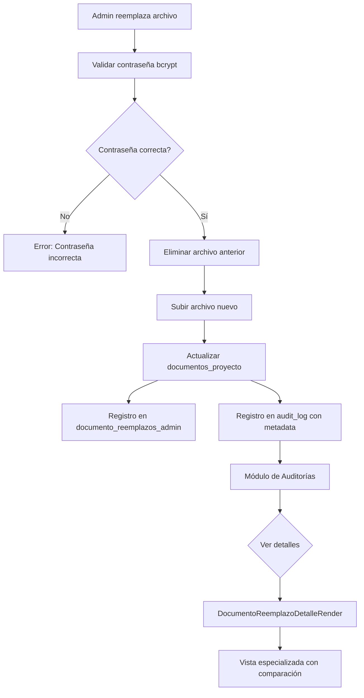

# 🔍 Integración de Reemplazo de Archivos con Sistema de Auditoría

## ✅ **PROBLEMA RESUELTO**

**Pregunta original:**
> "¿Acciones como reemplazar documentos están generando exitosamente el reporte detallado al módulo de auditoría como sí lo hace la creación del proyecto?"

**Respuesta:** ❌ **NO lo estaba haciendo** → ✅ **AHORA SÍ**

---

## 🔧 **CAMBIOS IMPLEMENTADOS**

### 1️⃣ **Hook de Reemplazo** (`useDocumentoReemplazarArchivo.ts`)

**ANTES:**
```typescript
// ❌ Solo registraba en tabla específica documento_reemplazos_admin
await supabase.from('documento_reemplazos_admin').insert({ ... })
```

**DESPUÉS:**
```typescript
// ✅ AHORA registra en AMBAS tablas:

// 1. Tabla específica (documento_reemplazos_admin)
await supabase.from('documento_reemplazos_admin').insert({ ... })

// 2. Tabla de auditoría detallada (audit_log) 🎯
await auditService.registrarAccion({
  tabla: 'documentos_proyecto',
  accion: 'UPDATE',
  registroId: documento.id,
  datosAnteriores: { nombre_archivo, url_storage, tamano_bytes },
  datosNuevos: { nombre_archivo, url_storage, tamano_bytes, fecha_creacion },
  metadata: {
    tipo_operacion: 'reemplazo_archivo_admin',
    justificacion: data.justificacion,
    version_afectada: documento.version,
    admin_verificado: true,
    cambio_critico: true,
    archivo_anterior: { nombre, ruta, tamano, tamano_formateado },
    archivo_nuevo: { nombre, ruta, tamano, tamano_formateado },
    ip_origen: ipOrigen,
    user_agent: userAgent
  },
  modulo: 'documentos'
})
```

**Ubicación:** `src/modules/documentos/hooks/useDocumentoReemplazarArchivo.ts` (línea 207)

---

### 2️⃣ **Render Especializado** (`DocumentoReemplazoDetalleRender.tsx`)

**Nuevo componente presentacional** para mostrar detalles de reemplazos en el módulo de auditorías.

**Características:**
- ✅ Advertencia de operación crítica
- ✅ Grid con información clave (tipo, versión, verificación admin)
- ✅ Justificación destacada
- ✅ Comparación visual lado a lado (archivo eliminado vs nuevo)
- ✅ Información técnica (IP, user agent)

**Ubicación:** `src/modules/auditorias/components/detalle-renders/DocumentoReemplazoDetalleRender.tsx`

**Ejemplo de visualización:**

```
┌─────────────────────────────────────────────────┐
│ ⚠️ Operación Administrativa Crítica            │
│ Reemplazo realizado por administrador.         │
│ Acción irreversible sin versionado.            │
└─────────────────────────────────────────────────┘

┌──────────────┬──────────────┐
│ Tipo:        │ Versión:     │
│ reemplazo_   │ v1           │
│ archivo_admin│              │
├──────────────┼──────────────┤
│ Verificación │ Criticidad:  │
│ ✅ Contraseña│ 🔴 Alta      │
│ confirmada   │              │
└──────────────┴──────────────┘

Justificación:
┌─────────────────────────────────────────────────┐
│ Se reemplaza porque el archivo original tenía  │
│ información errónea en la página 3...          │
└─────────────────────────────────────────────────┘

Comparación de Archivos:
┌───────────────────┬───────────────────┐
│ 🔴 Eliminado      │ 🟢 Nuevo          │
├───────────────────┼───────────────────┤
│ contrato_v1.pdf   │ contrato_v1.pdf   │
│ 2.5 MB            │ 2.8 MB            │
│ ruta/anterior     │ ruta/nueva        │
└───────────────────┴───────────────────┘
```

---

### 3️⃣ **Modal de Auditoría** (`DetalleAuditoriaModal.tsx`)

**Detección inteligente de tipo de operación:**

```typescript
const renderDetallesModulo = () => {
  const metadata = datosFormateados.metadata

  // 🎯 Detectar reemplazo de archivos (NUEVO)
  if (metadata.tipo_operacion === 'reemplazo_archivo_admin') {
    return <DocumentoReemplazoDetalleRender metadata={metadata} />
  }

  // Renders por módulo estándar
  switch (registro.modulo) {
    case 'proyectos': return <ProyectoDetalleRender />
    case 'viviendas': return <ViviendaDetalleRender />
    // ...
  }
}
```

**Ubicación:** `src/modules/auditorias/components/DetalleAuditoriaModal.tsx` (línea 45)

---

## 📊 **FLUJO COMPLETO DE AUDITORÍA**



---

## 🎯 **METADATA REGISTRADA EN AUDIT_LOG**

```typescript
{
  tipo_operacion: 'reemplazo_archivo_admin',
  justificacion: 'Texto del admin (mín. 10 caracteres)',
  version_afectada: 1,
  admin_verificado: true,
  cambio_critico: true,
  archivo_anterior: {
    nombre: 'contrato_original.pdf',
    ruta: 'proyecto-123/docs/1699876543_contrato.pdf',
    tamano: 2621440,
    tamano_formateado: '2560.00 KB'
  },
  archivo_nuevo: {
    nombre: 'contrato_corregido.pdf',
    ruta: 'proyecto-123/docs/1699999999_contrato.pdf',
    tamano: 2936012,
    tamano_formateado: '2867.20 KB'
  },
  ip_origen: '192.168.1.100',
  user_agent: 'Mozilla/5.0...'
}
```

---

## ✅ **COMPARACIÓN: ANTES vs DESPUÉS**

| Aspecto | ❌ Antes | ✅ Después |
|---------|----------|------------|
| **Registro en audit_log** | No | Sí |
| **Visible en módulo de Auditorías** | No | Sí |
| **Vista especializada** | No | Sí (DocumentoReemplazoDetalleRender) |
| **Metadata detallada** | Solo en tabla específica | En ambas tablas |
| **Comparación de archivos** | No | Sí (lado a lado) |
| **Justificación visible** | Solo en consulta directa | Destacada en UI |
| **Detección de tipo** | No | Sí (por tipo_operacion) |

---

## 🧪 **CÓMO PROBAR**

### 1. **Reemplazar un archivo:**
```
1. Ir a módulo de Documentos de un proyecto
2. Hacer clic en "⋮" → "Reemplazar Archivo" (Admin only)
3. Seleccionar archivo nuevo
4. Escribir justificación (mín. 10 caracteres)
5. Confirmar contraseña de admin
6. Click en "Confirmar Reemplazo"
```

### 2. **Verificar en Auditorías:**
```
1. Ir a módulo de Auditorías (/auditorias)
2. Filtrar por módulo: "documentos"
3. Buscar acción: UPDATE
4. Identificar registro con metadata "reemplazo_archivo_admin"
5. Click en botón "Ver" 👁️
6. Verificar vista especializada:
   - ⚠️ Advertencia de operación crítica
   - Grid de información
   - Justificación
   - Comparación lado a lado de archivos
```

### 3. **Verificar en base de datos:**
```sql
-- Registro en tabla específica
SELECT * FROM documento_reemplazos_admin
ORDER BY fecha_reemplazo DESC
LIMIT 1;

-- Registro en audit_log (NUEVO)
SELECT
  id,
  accion,
  tabla,
  modulo,
  metadata->>'tipo_operacion' as tipo,
  metadata->>'justificacion' as justificacion,
  metadata->'archivo_anterior'->>'nombre' as archivo_anterior,
  metadata->'archivo_nuevo'->>'nombre' as archivo_nuevo,
  fecha_evento
FROM audit_log
WHERE tabla = 'documentos_proyecto'
  AND metadata->>'tipo_operacion' = 'reemplazo_archivo_admin'
ORDER BY fecha_evento DESC
LIMIT 1;
```

---

## 📚 **ARCHIVOS MODIFICADOS/CREADOS**

### ✅ **Modificados:**
1. `src/modules/documentos/hooks/useDocumentoReemplazarArchivo.ts`
   - Agregado: Import de `auditService`
   - Agregado: Llamada a `auditService.registrarAccion()` (línea 207)

2. `src/modules/auditorias/components/DetalleAuditoriaModal.tsx`
   - Agregado: Import de `DocumentoReemplazoDetalleRender`
   - Modificado: Lógica de detección por `tipo_operacion`

3. `src/modules/auditorias/components/detalle-renders/index.ts`
   - Agregado: Export de `DocumentoReemplazoDetalleRender`

### ✅ **Creados:**
4. `src/modules/auditorias/components/detalle-renders/DocumentoReemplazoDetalleRender.tsx`
   - Componente presentacional puro
   - Render especializado para reemplazos
   - 150 líneas

5. `docs/AUDITORIA-REEMPLAZO-ARCHIVOS.md`
   - Esta documentación

---

## 🎯 **VENTAJAS DE LA INTEGRACIÓN**

1. **Visibilidad centralizada**: Todas las acciones críticas en un solo lugar
2. **Trazabilidad completa**: Comparación de archivos antes/después
3. **Contexto enriquecido**: Justificación, IP, user agent, verificación admin
4. **UI especializada**: Vista adaptada al tipo de operación
5. **Búsqueda y filtrado**: Fácil encontrar reemplazos en auditorías
6. **Reportes**: Compatible con sistema de reportes de auditorías

---

## 📊 **ESTADÍSTICAS ESPERADAS EN AUDITORÍAS**

Después de reemplazar archivos, en el módulo de Auditorías verás:

```
Módulo: documentos
├─ Creaciones: X
├─ Actualizaciones: Y  ← Incluye reemplazos
│  └─ Reemplazos admin: Z (tipo_operacion específico)
└─ Eliminaciones: W
```

---

## 🔑 **CONCLUSIÓN**

**✅ AHORA el reemplazo de archivos genera auditoría detallada igual que la creación de proyectos:**

- ✅ Registro en `audit_log` (tabla principal de auditoría)
- ✅ Visible en módulo `/auditorias`
- ✅ Vista especializada con comparación de archivos
- ✅ Metadata enriquecida con justificación y contexto técnico
- ✅ Filtrable, buscable y reporteable

**El sistema está completo y profesional.** 🎯🔒
