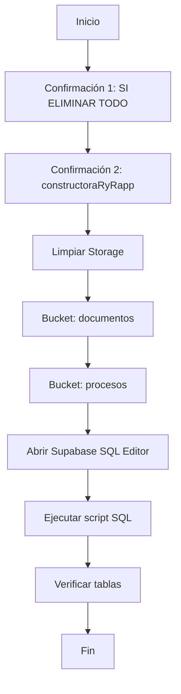

# 🧹 GUÍA DE LIMPIEZA COMPLETA DEL SISTEMA

## 📋 Índice
1. [Descripción](#descripción)
2. [Archivos Creados](#archivos-creados)
3. [Precauciones](#precauciones)
4. [Instrucciones de Uso](#instrucciones-de-uso)
5. [Orden de Ejecución](#orden-de-ejecución)
6. [Verificación](#verificación)
7. [FAQ](#faq)

---

## 📖 Descripción

Esta guía te ayudará a **limpiar completamente** la base de datos y el storage de Supabase, eliminando TODOS los datos pero manteniendo la estructura intacta.

### ¿Qué se elimina?

#### ✅ Base de Datos (SQL Script)
- ✗ Proyectos
- ✗ Manzanas
- ✗ Viviendas
- ✗ Clientes
- ✗ Negociaciones
- ✗ Abonos
- ✗ Renuncias
- ✗ Documentos
- ✗ Categorías de documentos
- ✗ Auditorías (acciones, cambios, errores)

#### ✅ Supabase Storage (PowerShell Script)
- ✗ Todos los archivos en bucket `documentos`
- ✗ Archivos en bucket `procesos` (excepto plantillas protegidas)

### ¿Qué NO se elimina?

#### ✅ Base de Datos
- ✓ Estructura de tablas (schemas)
- ✓ Constraints (claves foráneas, checks)
- ✓ Índices
- ✓ Funciones y triggers
- ✓ Row Level Security (RLS) policies
- ✓ **Usuarios** (tabla `usuarios` se mantiene intacta)

#### ✅ Supabase Storage
- ✓ Buckets (contenedores)
- ✓ Políticas de Storage
- ✓ Configuración de RLS
- ✓ **Plantillas de proceso** (carpeta `procesos/plantillas/` y archivos `plantilla-*`)
- ✓ **Templates** (archivos `template*` en bucket `procesos`)

---

## 📂 Archivos Creados

### 1. `supabase/migrations/LIMPIEZA_COMPLETA_BASE_DATOS.sql`
**Propósito**: Script SQL para limpiar todas las tablas de la base de datos

**Características**:
- Usa `TRUNCATE TABLE ... CASCADE` para eliminar datos
- Desactiva temporalmente las claves foráneas
- Orden correcto de limpieza (de hijos a padres)
- Query de verificación al final
- Comentarios detallados

**Tamaño**: ~150 líneas

### 2. `limpiar-storage-completo.ps1`
**Propósito**: Script PowerShell para limpiar buckets de Supabase Storage

**Características**:
- Elimina archivos recursivamente en carpetas
- **🛡️ PROTECCIÓN DE PLANTILLAS**: NO elimina archivos en `procesos/plantillas/`
- **🛡️ PROTECCIÓN**: Archivos que empiezan con `plantilla-` se preservan
- **🛡️ PROTECCIÓN**: Templates en bucket `procesos` se preservan
- Confirmación de seguridad
- Manejo de errores robusto
- Logs colorados y detallados
- Compatible con PowerShell 5.1+

**Tamaño**: ~260 líneas

**Archivos protegidos**:
```powershell
# Patrones protegidos (NO se eliminan):
- procesos/plantillas/          # Toda la carpeta
- procesos/plantilla-*          # Archivos individuales
- procesos/template*            # Templates
```

### 3. `limpiar-sistema-completo.ps1`
**Propósito**: Script maestro que ejecuta ambas limpiezas

**Características**:
- Doble confirmación de seguridad
- Ejecuta Storage primero, luego DB
- Abre automáticamente Supabase en el navegador
- Guía paso a paso interactiva
- Verificación manual al final

**Tamaño**: ~150 líneas

---

## ⚠️ Precauciones

### 🚨 ADVERTENCIAS CRÍTICAS

1. **NO ejecutar en producción**
   - Estos scripts están diseñados SOLO para desarrollo
   - Eliminarán TODOS los datos sin posibilidad de recuperación

2. **NO ejecutar si tienes datos importantes**
   - No hay función de "deshacer"
   - No se crean backups automáticos
   - Es tu responsabilidad hacer backup si lo necesitas

3. **Verificar credenciales**
   - Asegúrate de que las variables de entorno apunten al proyecto correcto
   - Verifica `NEXT_PUBLIC_SUPABASE_URL` en `.env.local`

4. **Usuarios NO se eliminan**
   - La tabla `usuarios` se mantiene intacta por seguridad
   - Si quieres eliminarla, descomenta la línea en el SQL

---

## 🚀 Instrucciones de Uso

### Opción 1: Script Maestro (RECOMENDADO)

Esta es la forma más fácil y segura:

```powershell
# Ejecutar desde la raíz del proyecto
.\limpiar-sistema-completo.ps1
```

**¿Qué hace?**
1. Solicita doble confirmación
2. Limpia Storage automáticamente
3. Abre Supabase SQL Editor
4. Te guía para ejecutar el script SQL
5. Abre Table Editor para verificación

**Confirmaciones requeridas**:
- Primera: Escribir `SI ELIMINAR TODO`
- Segunda: Escribir `constructoraRyRapp`

### Opción 2: Ejecución Manual

Si prefieres control total:

#### Paso 1: Limpiar Storage
```powershell
.\limpiar-storage-completo.ps1
```
- Confirmación: Escribir `SI`
- Elimina archivos de `documentos` y `procesos`

#### Paso 2: Limpiar Base de Datos
1. Abrir Supabase: https://supabase.com/dashboard/project/jqfbnggglbdiqbqtkubu/sql/new
2. Copiar TODO el contenido de `supabase/migrations/LIMPIEZA_COMPLETA_BASE_DATOS.sql`
3. Pegar en el editor SQL
4. Click en "Run"
5. Verificar mensaje de éxito

---

## 📊 Orden de Ejecución

### ¿Por qué Storage primero?

```
Storage (archivos) → Base de Datos (metadatos)
         ↑                      ↑
    Sin dependencias      Claves foráneas
```

**Razón**: Los archivos en Storage no tienen dependencias, pero los registros en DB tienen referencias a archivos. Si eliminamos DB primero, quedarían archivos huérfanos en Storage.

### Flujo Completo



---

## ✅ Verificación

### Después de la limpieza, verifica:

#### 1. Storage Vacío
```
Supabase Dashboard > Storage > documentos
└── 0 objects
Supabase Dashboard > Storage > procesos
└── 0 objects
```

#### 2. Tablas Vacías
Ejecuta el query de verificación (incluido en el script SQL):

```sql
SELECT
  'proyectos' as tabla,
  COUNT(*) as registros
FROM proyectos
UNION ALL
SELECT 'manzanas', COUNT(*) FROM manzanas
UNION ALL
-- ... (ver script completo)
ORDER BY tabla;
```

**Resultado esperado**:
| tabla | registros |
|-------|-----------|
| abonos | 0 |
| auditoria_acciones | 0 |
| auditoria_cambios | 0 |
| auditoria_errores | 0 |
| categorias_documentos | 0 |
| clientes | 0 |
| documentos | 0 |
| manzanas | 0 |
| negociaciones | 0 |
| proyectos | 0 |
| renuncias | 0 |
| usuarios | 1 (tu usuario) |
| viviendas | 0 |

#### 3. Estructura Intacta
Verifica que las tablas aún existen:

```sql
SELECT table_name
FROM information_schema.tables
WHERE table_schema = 'public'
ORDER BY table_name;
```

Deberías ver todas las tablas listadas.

---

## ❓ FAQ

### ¿Puedo recuperar los datos después?
**NO**. Esta operación es irreversible. No se crean backups automáticos.

### ¿Se eliminan los usuarios?
**NO** (por defecto). La tabla `usuarios` se mantiene intacta. Si quieres eliminarla, descomenta la línea en el SQL:
```sql
TRUNCATE TABLE usuarios CASCADE;
```

### ¿Qué pasa si el script de Storage falla?
El script tiene manejo de errores. Si falla:
1. Verifica las credenciales en `.env.local`
2. Verifica que el bucket existe en Supabase
3. Ejecuta manualmente desde el dashboard de Supabase

### ¿Puedo eliminar solo la base de datos?
Sí, ejecuta solo el script SQL sin el de Storage.

### ¿Puedo eliminar solo un bucket específico?
Sí, modifica `limpiar-storage-completo.ps1`:
```powershell
# Cambiar de:
$BUCKETS = @("documentos", "procesos")

# A (por ejemplo):
$BUCKETS = @("documentos")
```

### ¿Cómo hago un backup antes?
Desde Supabase Dashboard:
1. **Database**: Settings > Database > Backups > Create backup
2. **Storage**: Descargar manualmente desde el dashboard

### ¿Funciona en producción?
**SÍ, PERO NO DEBERÍAS**. Los scripts funcionan en cualquier entorno, pero están diseñados solo para desarrollo.

### ¿Qué pasa con las auditorías?
Se eliminan todas (acciones, cambios, errores). Si quieres mantenerlas, comenta estas líneas en el SQL:
```sql
-- TRUNCATE TABLE auditoria_acciones CASCADE;
-- TRUNCATE TABLE auditoria_cambios CASCADE;
-- TRUNCATE TABLE auditoria_errores CASCADE;
```

### ¿Se eliminan mis plantillas de proceso?
**NO**. Las plantillas están protegidas automáticamente. El script NO elimina:
- Carpeta completa: `procesos/plantillas/`
- Archivos que empiezan con: `plantilla-`
- Templates: archivos `template*`

### ¿Cómo proteger otros archivos?
Edita `limpiar-storage-completo.ps1` y agrega patrones a `$ARCHIVOS_PROTEGIDOS`:
```powershell
$ARCHIVOS_PROTEGIDOS = @(
    "procesos/plantillas/",     # Ya incluido
    "procesos/plantilla-",      # Ya incluido
    "procesos/template",        # Ya incluido
    "documentos/importante/",   # Ejemplo: proteger carpeta
    "procesos/config.json"      # Ejemplo: proteger archivo específico
)
```

### ¿Qué archivos están protegidos por defecto?
Ejecuta el script y verás al final:
```
🛡️  ARCHIVOS PROTEGIDOS (NO ELIMINADOS):
   • Carpeta: procesos/plantillas/
   • Archivos que empiezan con: plantilla-
   • Templates: procesos/template*
```
-- TRUNCATE TABLE auditoria_errores CASCADE;
```

---

## 🎯 Casos de Uso

### 1. Empezar de cero después de pruebas
```powershell
.\limpiar-sistema-completo.ps1
# Confirmar con "SI ELIMINAR TODO"
# Confirmar con "constructoraRyRapp"
```

### 2. Limpiar solo archivos huérfanos
```powershell
.\limpiar-storage-completo.ps1
```

### 3. Limpiar solo datos de prueba
Ejecutar solo el script SQL, dejando Storage intacto.

### 4. Resetear para demo
```powershell
# 1. Limpiar todo
.\limpiar-sistema-completo.ps1

# 2. Cargar datos de demo (crear script separado)
# ... (no incluido en este sistema)
```

---

## 📝 Notas Técnicas

### Truncate vs Delete
El script usa `TRUNCATE TABLE` porque:
- ✅ Más rápido (no escanea filas)
- ✅ Libera espacio en disco inmediatamente
- ✅ Resetea contadores de auto-increment (si los hubiera)
- ✅ `CASCADE` elimina datos en tablas relacionadas

### Session Replication Role
```sql
SET session_replication_role = 'replica';
-- ... truncates ...
SET session_replication_role = 'origin';
```

Esto desactiva temporalmente las claves foráneas para permitir eliminar en cualquier orden.

### Storage API
El script usa la REST API de Supabase Storage:
```
DELETE /storage/v1/object/{bucket}/{path}
```

Con autenticación `Bearer {ANON_KEY}`.

---

## ⚡ Próximos Pasos

Después de limpiar el sistema:

1. **Crear datos de prueba**
   - Crear 1-2 proyectos
   - Agregar manzanas
   - Registrar clientes

2. **Verificar funcionalidad**
   - Probar creación de viviendas
   - Subir documentos
   - Crear negociaciones

3. **Poblar categorías**
   - Categorías de documentos
   - Estados de negociación
   - Tipos de vivienda

---

## 🆘 Soporte

Si encuentras problemas:

1. **Error en Storage**:
   ```
   ❌ Error: 401 Unauthorized
   ```
   **Solución**: Verificar `NEXT_PUBLIC_SUPABASE_ANON_KEY` en `.env.local`

2. **Error en SQL**:
   ```
   ERROR: permission denied
   ```
   **Solución**: Verificar que tu usuario tiene permisos de administrador

3. **Script no se ejecuta**:
   ```
   cannot be loaded because running scripts is disabled
   ```
   **Solución**: Ejecutar en PowerShell como administrador:
   ```powershell
   Set-ExecutionPolicy -Scope CurrentUser -ExecutionPolicy RemoteSigned
   ```

---

## ✅ Checklist Final

Antes de ejecutar:
- [ ] Tengo backup de datos importantes (si los hay)
- [ ] Verifiqué que estoy en entorno de desarrollo
- [ ] Confirmé las credenciales en `.env.local`
- [ ] Leí todas las advertencias
- [ ] Entiendo que es irreversible

Durante la ejecución:
- [ ] Storage limpiado correctamente
- [ ] SQL ejecutado sin errores
- [ ] Query de verificación muestra 0 registros

Después:
- [ ] Todas las tablas vacías (excepto usuarios)
- [ ] Todos los buckets vacíos
- [ ] Estructura de DB intacta
- [ ] Sistema listo para nuevos datos

---

**Fecha de creación**: 2025-11-05
**Última actualización**: 2025-11-05
**Versión**: 1.0.0
**Autor**: GitHub Copilot
**Proyecto**: RyR Constructora - Sistema de Gestión Administrativa
