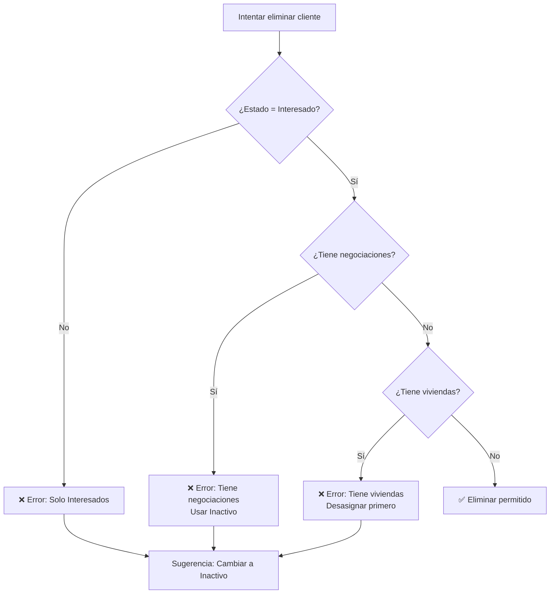

# 🛡️ Política de Eliminación de Clientes

## 📋 Resumen

El sistema implementa **restricciones estrictas** para eliminar clientes y proteger la integridad de los datos históricos y la trazabilidad del negocio.

---

## 🚫 Restricciones de Eliminación

### **NO se puede eliminar un cliente si:**

1. ✅ **Tiene historial de negociaciones** (activas o completadas)
2. ✅ **Tiene viviendas asignadas**
3. ✅ **No está en estado "Interesado"**

---

## ✅ ¿Cuándo SÍ se puede eliminar?

**Solo se permite eliminar clientes que cumplan TODAS estas condiciones:**

- ✅ Estado: **"Interesado"**
- ✅ Sin negociaciones (ni activas ni históricas)
- ✅ Sin viviendas asignadas
- ✅ Sin datos críticos de negocio

**Casos típicos:**
- Cliente recién creado por error
- Cliente duplicado
- Contacto inicial que nunca avanzó

---

## 🔄 Alternativa Recomendada: Estado "Inactivo"

Para clientes con historial de datos, **NO eliminar**. En su lugar:

### **Usar estado "Inactivo":**

```typescript
await cambiarEstado(clienteId, 'Inactivo')
```

**Ventajas:**
- ✅ Mantiene trazabilidad
- ✅ Conserva historial de negociaciones
- ✅ Permite auditoría futura
- ✅ No afecta reportes históricos
- ✅ Reversible (se puede reactivar)

---

## 🔧 Implementación Técnica

### **Servicio: `clientes.service.ts`**

```typescript
async eliminarCliente(id: string): Promise<void> {
  // 1. Verificar negociaciones
  const { data: negociaciones } = await supabase
    .from('negociaciones')
    .select('id, estado')
    .eq('cliente_id', id)
    .limit(1)

  if (negociaciones?.length > 0) {
    throw new Error(
      'No se puede eliminar un cliente con historial de negociaciones. ' +
      'Use el estado "Inactivo" en su lugar.'
    )
  }

  // 2. Verificar viviendas asignadas
  const { data: viviendas } = await supabase
    .from('viviendas')
    .select('id')
    .eq('cliente_id', id)
    .limit(1)

  if (viviendas?.length > 0) {
    throw new Error(
      'No se puede eliminar un cliente con viviendas asignadas.'
    )
  }

  // 3. Verificar estado
  const { data: cliente } = await supabase
    .from('clientes')
    .select('estado')
    .eq('id', id)
    .single()

  if (cliente?.estado !== 'Interesado') {
    throw new Error(
      'Solo se pueden eliminar clientes en estado "Interesado".'
    )
  }

  // 4. Eliminar si pasa todas las validaciones
  await supabase.from('clientes').delete().eq('id', id)
}
```

---

## 💬 Mensajes de Error

### **Error 1: Tiene negociaciones**

```
❌ No se puede eliminar un cliente con historial de negociaciones.
Use el estado "Inactivo" en su lugar para mantener la trazabilidad.
```

### **Error 2: Tiene viviendas asignadas**

```
❌ No se puede eliminar un cliente con viviendas asignadas.
Primero desasigne las viviendas o use el estado "Inactivo".
```

### **Error 3: Estado incorrecto**

```
❌ Solo se pueden eliminar clientes en estado "Interesado".
Para clientes con historial, use el estado "Inactivo".
```

---

## 🎯 Flujo de Decisión



---

## 📊 Comparación: Eliminar vs Inactivar

| Aspecto | Eliminar | Cambiar a Inactivo |
|---------|----------|-------------------|
| **Recuperación** | ❌ Imposible | ✅ Reversible |
| **Historial** | ❌ Se pierde | ✅ Se mantiene |
| **Negociaciones** | ❌ Se pierden | ✅ Se conservan |
| **Auditoría** | ❌ No trazable | ✅ Trazable |
| **Reportes** | ❌ Datos faltantes | ✅ Datos completos |
| **Uso recomendado** | Solo errores iniciales | Clientes con historial |

---

## 🔐 Integridad Referencial (Supabase)

### **Cascada de eliminación en BD:**

Cuando se elimina un cliente (después de pasar validaciones):

```sql
-- cliente_intereses: CASCADE
ON DELETE CASCADE
→ Se eliminan automáticamente los intereses del cliente

-- negociaciones: NO SE PERMITE (validado en código)
-- La función eliminarCliente() valida que NO tenga negociaciones

-- viviendas.cliente_id: SET NULL (validado en código)
-- La función valida que NO tenga viviendas asignadas
```

---

## 🧪 Casos de Prueba

### ✅ **Caso 1: Eliminación exitosa**

**Escenario:**
- Cliente en estado "Interesado"
- Sin negociaciones
- Sin viviendas

**Resultado:**
```
✅ Cliente eliminado exitosamente
✅ Intereses eliminados (CASCADE)
```

---

### ❌ **Caso 2: Cliente con negociación**

**Escenario:**
- Cliente estado "Activo"
- 1 negociación completada

**Resultado:**
```
❌ Error: No se puede eliminar un cliente con historial de negociaciones.
Use el estado "Inactivo" en su lugar.
```

---

### ❌ **Caso 3: Cliente con vivienda**

**Escenario:**
- Cliente estado "Activo"
- 1 vivienda asignada

**Resultado:**
```
❌ Error: No se puede eliminar un cliente con viviendas asignadas.
Primero desasigne las viviendas o use el estado "Inactivo".
```

---

### ❌ **Caso 4: Cliente activo sin vivienda**

**Escenario:**
- Cliente estado "Activo"
- Sin negociaciones
- Sin viviendas

**Resultado:**
```
❌ Error: Solo se pueden eliminar clientes en estado "Interesado".
Para clientes con historial, use el estado "Inactivo".
```

---

## 📝 Buenas Prácticas

### ✅ **SÍ hacer:**

- ✅ Usar "Inactivo" para clientes con historial
- ✅ Eliminar solo duplicados o errores iniciales
- ✅ Verificar estado antes de intentar eliminar
- ✅ Informar al usuario sobre las restricciones

### ❌ **NO hacer:**

- ❌ Eliminar clientes con datos históricos
- ❌ Forzar eliminación saltando validaciones
- ❌ Eliminar sin revisar dependencias
- ❌ Usar eliminación como "ocultar"

---

## 🔮 Futuro: Módulo de Negociaciones

Cuando se implemente el módulo de negociaciones:

### **Validaciones adicionales:**

```typescript
// Verificar negociaciones en TODOS los estados
const { data: negociaciones } = await supabase
  .from('negociaciones')
  .select('id, estado, monto')
  .eq('cliente_id', id)

if (negociaciones?.length > 0) {
  throw new Error(
    `No se puede eliminar. El cliente tiene ${negociaciones.length} negociación(es):
    ${negociaciones.map(n => `• ${n.estado}`).join('\n')}`
  )
}
```

### **Dashboard de estado:**

```tsx
// Mostrar warning visual si cliente no es eliminable
{cliente.negociaciones_activas > 0 && (
  <Badge variant="warning">
    No eliminable (tiene negociaciones)
  </Badge>
)}
```

---

## 📊 Estadísticas (Futuro)

Agregar al módulo de Clientes:

```typescript
interface ClienteEstadisticas {
  total: number
  eliminables: number       // Estado = Interesado + sin datos
  noEliminables: number     // Con negociaciones o viviendas
  inactivos: number         // Estado = Inactivo
}
```

---

## 🎯 Resumen Ejecutivo

| Pregunta | Respuesta |
|----------|-----------|
| **¿Puedo eliminar cualquier cliente?** | ❌ No, solo los que están en "Interesado" sin datos |
| **¿Qué hago con clientes antiguos?** | ✅ Cambiar a "Inactivo" |
| **¿Se pierden datos al inactivar?** | ❌ No, todo se conserva |
| **¿Puedo reactivar un cliente?** | ✅ Sí, cambiar estado a "Activo" |
| **¿Por qué tanta restricción?** | 🛡️ Integridad de datos y auditoría |

---

## ✅ Implementación Completada

- [x] Función `eliminarCliente()` con 4 validaciones
- [x] Verificación de negociaciones (cualquier estado)
- [x] Verificación de viviendas asignadas
- [x] Verificación de estado del cliente
- [x] Mensajes de error descriptivos
- [x] Modal de confirmación con advertencias
- [x] Manejo de errores en UI
- [x] Documentación completa

---

**Estado:** ✅ **POLÍTICA DE ELIMINACIÓN IMPLEMENTADA Y DOCUMENTADA**

La integridad de datos está protegida. Los clientes con historial importante no podrán ser eliminados accidentalmente. 🛡️
