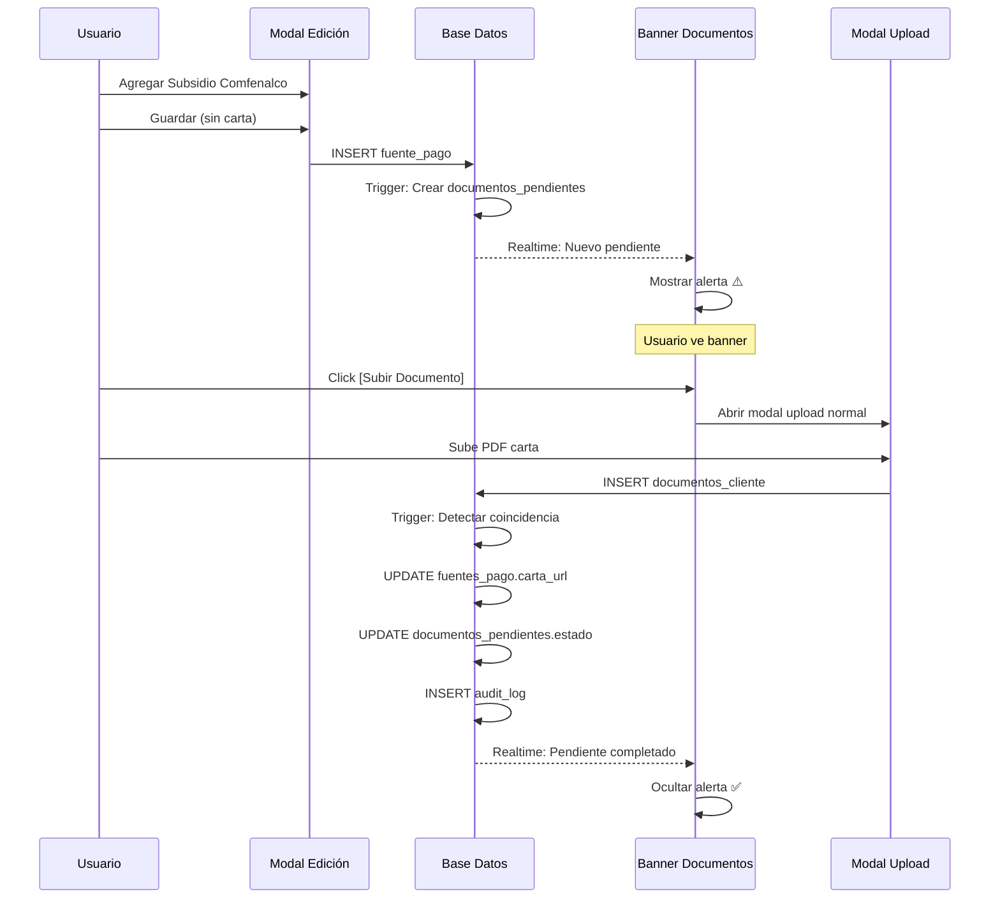

# 🎯 Resumen: Sistema de Documentos Pendientes

**Fecha**: 2025-11-29
**Versión**: 1.0.0

---

## ❓ **Pregunta Original**

> *"¿Cómo hacemos para agregar cartas de aprobación si un cliente inicialmente tenía solo Cuota Inicial y después consigue Subsidio o Crédito?"*

---

## ✅ **Solución Implementada**

### **1️⃣ Modal NO bloquea guardar**

```tsx
// Usuario puede agregar fuente SIN carta
<EditarFuentesPagoModal>
  Agregar Subsidio Comfenalco: $15.000.000
  [Guardar] ✅ <- Permite guardar sin carta
</EditarFuentesPagoModal>
```

💡 **Info visible:**
> "Puedes guardar sin la carta. El sistema creará un recordatorio en la pestaña Documentos."

---

### **2️⃣ Sistema crea pendiente automáticamente**

**Trigger en base de datos:**
```sql
INSERT INTO documentos_pendientes (
  fuente_pago_id,
  cliente_id,
  tipo_documento: "Carta Subsidio Caja - Comfenalco",
  metadata: {
    tipo_fuente: "Subsidio Caja Compensación",
    entidad: "Comfenalco",
    monto: 15000000
  },
  prioridad: "Alta"
)
```

---

### **3️⃣ Banner alerta en Pestaña Documentos**

```
┌─────────────────────────────────────────────────────────────┐
│ ⚠️ Documentos Pendientes (1)                                │
│                                                               │
│ ┌─────────────────────────────────────────────────────────┐ │
│ │ 📄 Carta Subsidio Caja Compensación - Comfenalco       │ │
│ │ Requerida para: Fuente de Pago #2                      │ │
│ │ Monto: $15.000.000                                      │ │
│ │ [📤 Subir Documento]                                    │ │
│ └─────────────────────────────────────────────────────────┘ │
└─────────────────────────────────────────────────────────────┘
```

**Features:**
- ✅ Tiempo real (Supabase Realtime)
- ✅ Prioridad visual (Alta = rojo, Media = naranja)
- ✅ Botón directo para subir

---

### **4️⃣ Usuario sube documento NORMAL**

```tsx
// NO hay botón especial, sube como documento cualquiera
<DocumentoUpload
  categoria="Cartas de Aprobación" // ← Lo único importante
  metadata={{
    tipo_fuente: "Subsidio Caja Compensación", // ← Auto-detecta
    entidad: "Comfenalco"
  }}
/>
```

**NO requiere:**
- ❌ Botón especial
- ❌ Flujo diferente
- ❌ Indicar manualmente vinculación

---

### **5️⃣ Sistema vincula AUTOMÁTICAMENTE**

**Trigger detecta coincidencia:**
```sql
-- ¿Hay un pendiente que coincida?
SELECT * FROM documentos_pendientes
WHERE cliente_id = :cliente_id
  AND categoria_id = '4898e798-...' -- Cartas Aprobación
  AND metadata->>'tipo_fuente' = :tipo_fuente
  AND metadata->>'entidad' = :entidad
  AND estado = 'Pendiente'
```

**Si coincide:**
1. ✅ Actualiza `fuentes_pago.carta_aprobacion_url`
2. ✅ Cambia `estado_documentacion = 'Completo'`
3. ✅ Marca `documentos_pendientes.estado = 'Completado'`
4. ✅ Registra en `audit_log`

---

### **6️⃣ Banner desaparece automáticamente**

```
┌─────────────────────────────────────────────────────────────┐
│ ✅ Todos los documentos están completos                     │
└─────────────────────────────────────────────────────────────┘
```

---

## 🎨 **Flujo Visual Completo**



---

## 🗂️ **Archivos Creados/Modificados**

### **Base de Datos:**
- ✅ `supabase/migrations/20251129_agregar_estado_documentacion_fuentes.sql`
  - Tabla `documentos_pendientes`
  - Columna `fuentes_pago.estado_documentacion`
  - Trigger crear pendiente
  - Trigger vincular automático

### **Componentes:**
- ✅ `src/modules/clientes/components/documentos-pendientes/BannerDocumentosPendientes.tsx`
- ✅ `src/modules/clientes/components/documentos-pendientes/useBannerDocumentosPendientes.ts`
- ✅ `src/modules/clientes/components/documentos-pendientes/index.ts`

### **Integración:**
- ✅ `src/app/clientes/[id]/tabs/documentos-tab.tsx` (agregado banner)
- ✅ `src/app/clientes/[id]/tabs/negociaciones/EditarFuentesPagoModal.tsx` (info box)

### **Documentación:**
- ✅ `docs/SISTEMA-DOCUMENTOS-PENDIENTES.md` (guía completa)
- ✅ `.github/copilot-instructions.md` (regla crítica #-5.8)

---

## 🔍 **Cómo Funciona la Detección Automática**

### **Metadata en documento subido:**
```json
{
  "tipo_fuente": "Subsidio Caja Compensación",
  "entidad": "Comfenalco",
  "vivienda": "A5",
  "subido_desde": "pestaña_documentos"
}
```

### **Metadata en pendiente:**
```json
{
  "tipo_fuente": "Subsidio Caja Compensación",
  "entidad": "Comfenalco",
  "monto": 15000000
}
```

### **Coincidencia:**
```sql
WHERE dp.metadata->>'tipo_fuente' = doc.metadata->>'tipo_fuente'
  AND dp.metadata->>'entidad' = doc.metadata->>'entidad'
  AND dp.cliente_id = doc.entidad_id
  AND dp.categoria_id = doc.categoria_id
```

✅ **Si coincide TODO** → Vincula automáticamente

---

## 📊 **Queries de Verificación**

### **Ver pendientes de un cliente:**
```sql
SELECT
  tipo_documento,
  prioridad,
  metadata->>'tipo_fuente' as tipo,
  metadata->>'entidad' as entidad,
  fecha_creacion
FROM documentos_pendientes
WHERE cliente_id = '<id>' AND estado = 'Pendiente';
```

### **Ver vinculaciones automáticas:**
```sql
SELECT
  fecha_creacion,
  metadata->>'tipo_fuente',
  metadata->>'documento_id'
FROM audit_log
WHERE accion = 'VINCULACION_AUTOMATICA_DOCUMENTO'
ORDER BY fecha_creacion DESC;
```

---

## ✅ **Testing Checklist**

- [x] Crear fuente con Crédito sin carta → Aparece pendiente
- [x] Crear fuente con Subsidio sin carta → Aparece pendiente
- [x] Crear fuente con Cuota Inicial → NO aparece pendiente
- [ ] Subir carta con metadata correcta → Vincula y desaparece
- [ ] Subir carta con metadata incorrecta → NO vincula (queda en lista normal)
- [ ] Realtime: Banner actualiza en tiempo real
- [ ] Dark mode: Colores correctos
- [ ] Responsive: Mobile funciona
- [ ] Auditoría: Registro en audit_log

---

## 🚀 **Ventajas del Sistema**

1. **No bloquea al usuario**: Puede avanzar aunque falte documento
2. **Rastreabilidad completa**: Sabe qué documentos faltan y desde cuándo
3. **Vinculación inteligente**: No requiere acción manual
4. **Tiempo real**: Banner actualiza al instante
5. **Extensible**: Fácil agregar notificaciones/recordatorios
6. **Auditable**: Registra todas las vinculaciones automáticas

---

## 🎉 **Estado: ✅ IMPLEMENTADO Y LISTO**

**Migración ejecutada:** ✅
**Tipos sincronizados:** ✅
**Componentes creados:** ✅
**Documentación completa:** ✅
**Instrucciones actualizadas:** ✅

---

**📚 Ver documentación completa:** `docs/SISTEMA-DOCUMENTOS-PENDIENTES.md`
