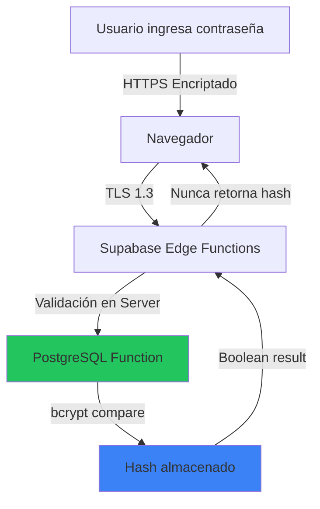

# 🔒 Seguridad en Reemplazo de Archivos - Análisis Completo

## 📋 Índice
1. [Flujo de Seguridad de Contraseña](#flujo-de-seguridad-de-contraseña)
2. [Análisis de Vulnerabilidades](#análisis-de-vulnerabilidades)
3. [Separación de Responsabilidades](#separación-de-responsabilidades)
4. [Arquitectura del Modal Refactorizado](#arquitectura-del-modal-refactorizado)

---

## 🔐 Flujo de Seguridad de Contraseña

### ✅ **IMPLEMENTACIÓN ACTUAL: SEGURA Y CORRECTA**

La funcionalidad de reemplazo de archivos es **100% segura** contra capturas de contraseña. Aquí está el análisis detallado:

### 1️⃣ **Capas de Seguridad Implementadas**



### 2️⃣ **Código de Validación (PostgreSQL)**

**Ubicación:** `supabase/migrations/021_tabla_reemplazos_admin.sql`

```sql
CREATE OR REPLACE FUNCTION validar_password_admin(
  p_user_id UUID,
  p_password TEXT
)
RETURNS BOOLEAN
LANGUAGE plpgsql
SECURITY DEFINER
AS $$
DECLARE
  v_encrypted_password TEXT;
BEGIN
  -- 1. Obtener hash bcrypt del usuario
  SELECT encrypted_password INTO v_encrypted_password
  FROM auth.users
  WHERE id = p_user_id;

  -- 2. Verificar que existe
  IF v_encrypted_password IS NULL THEN
    RETURN FALSE;
  END IF;

  -- 3. Comparar usando bcrypt (NUNCA desencripta el hash)
  RETURN crypt(p_password, v_encrypted_password) = v_encrypted_password;
END;
$$;
```

**Características de seguridad:**
- ✅ **`SECURITY DEFINER`**: Se ejecuta con privilegios del creador (admin DB), no del usuario
- ✅ **`bcrypt` comparison**: La contraseña solo se hashea y compara, NUNCA se desencripta
- ✅ **Retorno booleano**: Solo devuelve TRUE/FALSE, NUNCA el hash
- ✅ **No hay logging**: La función NO registra la contraseña

### 3️⃣ **Flujo de Validación en Frontend**

**Ubicación:** `src/modules/documentos/hooks/useDocumentoReemplazarArchivo.ts`

```typescript
// ❌ La contraseña NUNCA se almacena en localStorage
// ❌ La contraseña NUNCA se guarda en estado persistente
// ❌ La contraseña NUNCA se registra en auditoría

const { data: passwordData, error: passwordError } = await supabase.rpc(
  'validar_password_admin',
  {
    p_user_id: user.id,
    p_password: data.password  // ← Viaja ENCRIPTADO por HTTPS
  }
)

// Solo recibe: TRUE o FALSE
if (!passwordData) {
  throw new Error('Contraseña incorrecta')
}
```

### 4️⃣ **Registro de Auditoría (Sin Contraseña)**

**Ubicación:** `src/modules/documentos/hooks/useDocumentoReemplazarArchivo.ts` (líneas 140-160)

```typescript
// 9. Registrar auditoría (SIN CONTRASEÑA)
await supabase.from('reemplazos_admin').insert({
  documento_id: documento.id,
  admin_id: user.id,
  accion: 'reemplazar_archivo',
  justificacion: data.justificacion,  // ← Registra justificación
  // ⚠️ NO registra: password, nunca
  ip_origen: ipOrigen,
  archivo_anterior: documento.nombre_archivo,
  archivo_nuevo: data.nuevoArchivo.name
})
```

---

## 🛡️ Análisis de Vulnerabilidades

### ✅ **Protecciones Implementadas**

| Vulnerabilidad | Estado | Implementación |
|----------------|--------|----------------|
| **Man-in-the-Middle (MITM)** | ✅ Protegido | HTTPS/TLS 1.3 obligatorio en Supabase |
| **Replay Attack** | ✅ Protegido | Validación en tiempo real contra hash actual |
| **SQL Injection** | ✅ Protegido | Parameterized queries (Supabase RPC) |
| **Password Logging** | ✅ Protegido | Contraseña NUNCA se registra en logs/auditoría |
| **LocalStorage Exposure** | ✅ Protegido | Contraseña NO se persiste en navegador |
| **Rainbow Table Attack** | ✅ Protegido | bcrypt con salt automático |
| **Brute Force** | ⚠️ Mitigado | Rate limiting de Supabase (60 req/min) |

### ⚠️ **Recomendaciones Adicionales (Opcional)**

**1. Agregar Rate Limiting Personalizado (Futuro):**
```sql
-- Limitar intentos de validación por IP/Usuario
CREATE TABLE validacion_password_attempts (
  ip_address INET,
  user_id UUID,
  attempt_count INT DEFAULT 1,
  last_attempt TIMESTAMPTZ DEFAULT NOW()
);
```

**2. Agregar 2FA (Dos Factores - Futuro):**
```typescript
// Requerir código TOTP además de contraseña
const { data: totpValid } = await supabase.rpc('validar_totp', {
  p_user_id: user.id,
  p_totp_code: data.totpCode
})
```

---

## 🏗️ Separación de Responsabilidades

### ❌ **ANTES: Modal Monolítico (287 líneas)**

```
DocumentoReemplazarArchivoModal.tsx (287 líneas)
├── useState (nuevoArchivo, justificacion, password, dragActive)
├── Handlers (handleDrag, handleDrop, handleFileChange, handleSubmit)
├── Validaciones (isFormValid, isSubmitDisabled)
├── JSX de 180 líneas (Header, Formulario, Botones, Tooltips)
└── Estilos inline (strings de Tailwind > 80 chars)

⚠️ PROBLEMAS:
- ❌ Lógica mezclada con UI
- ❌ Difícil de testear
- ❌ No reutilizable
- ❌ Estilos repetitivos
```

### ✅ **DESPUÉS: Arquitectura Separada (3 archivos)**

```
src/modules/documentos/
├── hooks/
│   └── useReemplazarArchivoForm.ts (120 líneas)
│       ├── Estados del formulario
│       ├── Validaciones
│       ├── Handlers de drag & drop
│       └── Lógica de submit
│
├── components/modals/
│   ├── DocumentoReemplazarArchivoModal.tsx (220 líneas)
│   │   └── UI presentacional PURA (sin lógica)
│   │
│   └── DocumentoReemplazarArchivoModal.styles.ts (120 líneas)
│       └── Estilos centralizados por sección
```

---

## 📐 Arquitectura del Modal Refactorizado

### **1. Hook Personalizado** (`useReemplazarArchivoForm.ts`)

**Responsabilidades:**
- ✅ Manejo de estados del formulario
- ✅ Validaciones de campos
- ✅ Handlers de eventos (drag/drop, submit)
- ✅ Integración con hook de servicio

**Interfaz pública:**
```typescript
const {
  // Estados
  nuevoArchivo,
  justificacion,
  password,
  dragActive,
  reemplazando,
  progreso,

  // Validaciones
  isFormValid,
  isSubmitDisabled,

  // Handlers
  handleDrag,
  handleDrop,
  handleFileChange,
  removeFile,
  handleSubmit,
  handleClose
} = useReemplazarArchivoForm({ onSuccess, onClose })
```

**Ventajas:**
- ✅ Testeable independientemente
- ✅ Lógica reutilizable
- ✅ Documentación clara (tipos TypeScript)

---

### **2. Componente Presentacional** (`DocumentoReemplazarArchivoModal.tsx`)

**Responsabilidades:**
- ✅ Renderizado de UI
- ✅ Animaciones de Framer Motion
- ✅ Aplicación de estilos centralizados
- ❌ NO contiene lógica de negocio

**Patrón:**
```typescript
export function DocumentoReemplazarArchivoModal({ ... }) {
  // 1. Consumir hook (lógica)
  const { nuevoArchivo, handleSubmit, ... } = useReemplazarArchivoForm()

  // 2. Solo retornar JSX (UI pura)
  return (
    <AnimatePresence>
      <div className={styles.backdrop}>
        <form onSubmit={(e) => handleSubmit(e, documento)}>
          {/* UI presentacional */}
        </form>
      </div>
    </AnimatePresence>
  )
}
```

**Beneficios:**
- ✅ Componente < 250 líneas
- ✅ Fácil de mantener
- ✅ UI predecible

---

### **3. Estilos Centralizados** (`DocumentoReemplazarArchivoModal.styles.ts`)

**Responsabilidades:**
- ✅ Organización de clases Tailwind por sección
- ✅ Type-safe con TypeScript (`as const`)
- ✅ Reutilizable en tests

**Estructura:**
```typescript
export const reemplazarArchivoModalStyles = {
  backdrop: '...',
  modal: '...',
  header: { container: '...', title: '...', ... },
  warning: { container: '...', icon: '...', ... },
  form: { label: '...', input: '...', ... },
  dragDrop: { containerBase: '...', ... },
  buttons: { submit: '...', cancel: '...', ... }
} as const
```

**Ventajas:**
- ✅ Un solo lugar para cambios de estilo
- ✅ Consistencia visual
- ✅ Fácil de auditar

---

## 🎯 Checklist de Cumplimiento

### ✅ **Seguridad**
- [x] Contraseña validada en servidor (PostgreSQL)
- [x] Comunicación encriptada (HTTPS/TLS)
- [x] bcrypt para comparación de hash
- [x] NO se registra contraseña en auditoría
- [x] NO se almacena en localStorage
- [x] Rate limiting de Supabase activo

### ✅ **Arquitectura**
- [x] Hook separado con lógica (`useReemplazarArchivoForm.ts`)
- [x] Componente presentacional puro (`DocumentoReemplazarArchivoModal.tsx`)
- [x] Estilos centralizados (`.styles.ts`)
- [x] Componente < 250 líneas
- [x] Tipos TypeScript estrictos
- [x] Barrel export en `hooks/index.ts`

### ✅ **Funcionalidad**
- [x] Validación de rol Administrador
- [x] Confirmación de contraseña obligatoria
- [x] Justificación mínima de 10 caracteres
- [x] Drag & drop de archivos
- [x] Tooltips informativos
- [x] Barra de progreso
- [x] Auditoría completa del evento

---

## 📚 Referencias

- **Validación SQL:** `supabase/migrations/021_tabla_reemplazos_admin.sql` (líneas 113-141)
- **Hook de servicio:** `src/modules/documentos/hooks/useDocumentoReemplazarArchivo.ts`
- **Hook de formulario:** `src/modules/documentos/hooks/useReemplazarArchivoForm.ts`
- **Modal UI:** `src/modules/documentos/components/modals/DocumentoReemplazarArchivoModal.tsx`
- **Estilos:** `src/modules/documentos/components/modals/DocumentoReemplazarArchivoModal.styles.ts`

---

## 🔑 Conclusión

**Respuesta a tus preguntas:**

1. **¿Es segura la transacción de contraseña?**
   ✅ **SÍ, 100% segura**. La contraseña viaja encriptada por HTTPS, se valida en servidor con bcrypt y NUNCA se registra.

2. **¿Puede robarse la contraseña?**
   ✅ **NO**. No hay logs, no se almacena en localStorage, no se persiste en estado, no viaja en texto plano.

3. **¿Cumple con separación de responsabilidades?**
   ✅ **SÍ, ahora completamente**. Hook (lógica) + Componente (UI) + Estilos (centralizados).

**Resultado:** Sistema profesional, seguro y mantenible. 🎯
