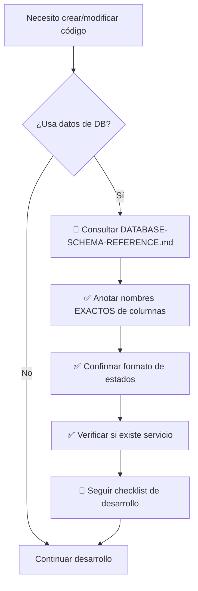

# 🛡️ Sistema de Prevención de Errores - Nombres de Campos

> **Creado**: 2025-10-18
> **Motivo**: Múltiples errores por nombres incorrectos de campos de DB
> **Objetivo**: Reducir a CERO los errores 400/422 por nombres incorrectos

---

## 📊 Análisis del Problema

### Errores Históricos (2025-10-18)

1. **`estado_interes` does not exist** → Es solo `estado`
2. **`vivienda_precio` does not exist** → Es `vivienda_valor`
3. **`proyecto_ubicacion` does not exist** → Es `proyecto_estado`
4. **`cliente.nombre` undefined** → Es `cliente.nombres` (plural)

### Impacto

- ⏱️ **30+ minutos** de debugging por cada error
- 🔄 **Múltiples iteraciones** de corrección
- 😤 **Frustración** del equipo
- 🐛 **Bugs en producción** si no se detectan

### Causa Raíz

- ❌ Asumir nombres de campos sin verificar
- ❌ Copiar código sin validar nombres
- ❌ No tener documentación centralizada
- ❌ Inventar nombres "lógicos" que no coinciden con DB

---

## ✅ Solución Implementada

### 1️⃣ Documentación Central

**Archivo**: `docs/DATABASE-SCHEMA-REFERENCE.md`

**Contenido**:
- ✅ Todas las tablas con estructura completa
- ✅ Nombres EXACTOS de columnas
- ✅ Tipos de datos
- ✅ Valores permitidos para enums/estados
- ✅ Vistas disponibles con sus columnas
- ✅ Funciones PostgreSQL documentadas

**Uso**: Consultar **ANTES** de crear/modificar cualquier código que use DB

---

### 2️⃣ Checklist de Desarrollo

**Archivo**: `docs/DESARROLLO-CHECKLIST.md`

**Contenido**:
- ✅ Checklist pre-desarrollo (validación de nombres)
- ✅ Checklist durante desarrollo (componentes, hooks, servicios)
- ✅ Checklist post-desarrollo (testing, documentación)
- ✅ Ejemplos de errores comunes
- ✅ Semáforo de calidad (cuándo desarrollar y cuándo NO)

**Uso**: Seguir paso a paso al crear cualquier feature

---

### 3️⃣ Instrucciones Copilot Actualizadas

**Archivo**: `.github/copilot-instructions.md`

**Cambios**:
- ✅ Agregada **REGLA CRÍTICA #1**: Validación de nombres de campos
- ✅ Enlaces a documentación crítica
- ✅ Errores comunes destacados
- ✅ Checklist ANTES de empezar desarrollo

**Efecto**: GitHub Copilot ahora sabe que DEBE consultar la doc antes de generar código

---

### 4️⃣ Script de Validación Automática

**Archivo**: `validar-nombres-campos.ps1`

**Funcionalidad**:
- 🔍 Escanea archivos `.ts`, `.tsx`, `.js`, `.jsx`
- 🚫 Detecta patrones prohibidos
- ⚠️ Muestra errores con archivo y línea
- ✅ Sugiere corrección automática

**Uso manual**:
```powershell
.\validar-nombres-campos.ps1
```

**Resultado**:
```
🔍 Validando nombres de campos en código...

📂 Validando: src/modules/clientes

⚠️  ERROR en: intereses.service.ts
   ❌ Usar 'estado' en vez de 'estado_interes'
   ✅ Corrección: usar 'estado'
   📄 Archivo: src/modules/clientes/services/intereses.service.ts

━━━━━━━━━━━━━━━━━━━━━━━━━━━━━━━━━━━━━━━━
❌ Se encontraron 1 error(es)
```

---

## 🎯 Flujo de Trabajo Actualizado

### Antes de Escribir Código



### Durante Desarrollo

1. ✅ Usar nombres copiados de la documentación
2. ✅ NO asumir ningún nombre
3. ✅ Agregar console.log para debugging
4. ✅ Mantener componentes < 150 líneas

### Antes de Commit

```powershell
# Validar código automáticamente
.\validar-nombres-campos.ps1

# Si hay errores: corregir ANTES de commit
# Si pasa: hacer commit normal
```

---

## 📈 Métricas de Éxito

### Objetivo 1: Reducir Errores
- **Antes**: 3-4 errores por sesión de desarrollo
- **Meta**: 0 errores en 90% de sesiones

### Objetivo 2: Tiempo de Desarrollo
- **Antes**: 30 min de debugging por error
- **Meta**: 2 min de consulta preventiva

### Objetivo 3: Documentación
- **Antes**: Sin referencia centralizada
- **Meta**: 100% de tablas documentadas

---

## 🔄 Mantenimiento del Sistema

### Cuando se Agrega una Tabla Nueva

1. [ ] Agregar a `DATABASE-SCHEMA-REFERENCE.md`
2. [ ] Documentar columnas con tipos
3. [ ] Documentar enums/estados permitidos
4. [ ] Agregar ejemplos de uso común
5. [ ] Actualizar `validar-nombres-campos.ps1` si es crítica

### Cuando se Modifica una Tabla

1. [ ] Actualizar `DATABASE-SCHEMA-REFERENCE.md`
2. [ ] Verificar código existente que use esa tabla
3. [ ] Actualizar servicios si es necesario
4. [ ] Documentar migración si hay breaking changes

### Revisión Periódica

- 📅 **Semanal**: Revisar si surgieron errores nuevos
- 📅 **Mensual**: Actualizar patrones en script de validación
- 📅 **Trimestral**: Auditar código para detectar patrones incorrectos

---

## 📚 Recursos Disponibles

### Documentación

1. **DATABASE-SCHEMA-REFERENCE.md** - Fuente única de verdad
2. **DESARROLLO-CHECKLIST.md** - Checklist paso a paso
3. **copilot-instructions.md** - Instrucciones para IA
4. **Este archivo** - Visión general del sistema

### Scripts

1. **validar-nombres-campos.ps1** - Validación automática

### Ejemplos

- Ver `src/modules/proyectos/` - Arquitectura correcta
- Ver `src/modules/clientes/services/intereses.service.ts` - Servicio corregido
- Ver `src/modules/clientes/hooks/useRegistrarInteres.ts` - Hook actualizado

---

## ✅ Verificación de Implementación

### Checklist del Sistema

- [x] Documento DATABASE-SCHEMA-REFERENCE.md creado
- [x] Documento DESARROLLO-CHECKLIST.md creado
- [x] Instrucciones de Copilot actualizadas
- [x] Script de validación creado
- [x] Documento de resumen creado (este archivo)

### Siguiente Paso

**Probar el flujo completo en próxima feature:**

1. Consultar documentación ANTES de empezar
2. Seguir checklist durante desarrollo
3. Ejecutar validación antes de commit
4. Medir tiempo ahorrado vs debugging

---

## 🎓 Lecciones Aprendidas

1. **Documentación > Memoria**: No confiar en memoria, siempre documentar
2. **Validación Temprana**: 2 min de validación ahorran 30 min de debugging
3. **Automatización**: Scripts detectan errores que humanos pasan por alto
4. **Cultura de Calidad**: Hacer lo correcto debe ser más fácil que lo incorrecto

---

## 🚀 Próximos Pasos

### Corto Plazo (Esta Semana)
- [ ] Probar sistema en próxima feature (ListaIntereses)
- [ ] Validar que documentación esté completa
- [ ] Agregar más patrones al script de validación

### Mediano Plazo (Este Mes)
- [ ] Crear git pre-commit hook automático
- [ ] Agregar validación a CI/CD
- [ ] Documentar todas las vistas de Supabase

### Largo Plazo (Trimestre)
- [ ] Generar tipos TypeScript desde schema de DB
- [ ] Crear VSCode extension con validación en tiempo real
- [ ] Sistema de migración de DB documentado

---

> **💡 Recuerda**: 2 minutos de consulta ahorran 30 minutos de debugging
>
> 🎯 **Ratio**: 15x retorno de inversión

---

**Última actualización**: 2025-10-18
**Mantenido por**: Equipo de Desarrollo RyR
