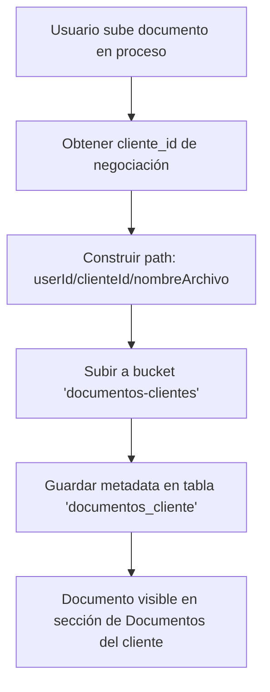

# ✅ UNIFICACIÓN: Sistema de Documentos de Procesos

## 🎯 Objetivo

Unificar el sistema de almacenamiento de documentos para usar una **única fuente de verdad** en lugar de tener sistemas separados para documentos de clientes y documentos de procesos.

---

## 📋 Cambios Realizados

### ❌ **ANTES: Sistema Separado**

```typescript
// Bucket separado
bucketName: 'documentos-procesos'

// Path separado
{userId}/procesos/{negociacionId}/{pasoId}/{nombreArchivo}

// Dos buckets diferentes:
// - documentos-clientes (para documentos de clientes)
// - documentos-procesos (para documentos del proceso)
```

**Problemas:**
- Duplicación de infraestructura
- Más RLS policies que mantener
- Búsquedas fragmentadas
- Dos lugares para buscar documentos del mismo cliente

---

### ✅ **AHORA: Sistema Unificado**

```typescript
// Bucket único
bucketName: 'documentos-clientes'

// Path unificado (misma estructura)
{userId}/{clienteId}/{nombreArchivo}

// Un solo bucket:
// - documentos-clientes (TODO)
```

**Beneficios:**
- ✅ Una sola fuente de verdad
- ✅ RLS policies centralizadas
- ✅ Búsquedas unificadas
- ✅ Todos los documentos del cliente en un solo lugar
- ✅ Más fácil de mantener

---

## 🔧 Archivos Modificados

### 1. `documentos-proceso.service.ts`

**Cambio en configuración:**
```typescript
// ANTES
bucketName: 'documentos-procesos'

// AHORA
bucketName: 'documentos-clientes'  // ✅ UNIFICADO
```

**Cambio en path de storage:**
```typescript
// ANTES
function construirStoragePath(
  userId: string,
  negociacionId: string,
  pasoId: string,
  documentoNombre: string,
  extension: string
): string {
  return `${userId}/procesos/${negociacionId}/${pasoId}/${nombreArchivo}`
}

// AHORA
function construirStoragePath(
  userId: string,
  clienteId: string,      // ✅ Usa cliente_id en lugar de negociacionId
  documentoNombre: string,
  extension: string
): string {
  return `${userId}/${clienteId}/${nombreArchivo}`  // ✅ Misma estructura
}
```

**Cambio en función `subirDocumento`:**
```typescript
// AHORA obtiene el cliente_id primero
const { data: negociacion } = await supabase
  .from('negociaciones')
  .select('cliente_id')
  .eq('id', negociacionId)
  .single()

// Usa cliente_id para construir path
const storagePath = construirStoragePath(
  userId,
  negociacion.cliente_id,  // ✅ En lugar de negociacionId
  documentoNombre,
  extension
)
```

---

## 📊 Flujo Unificado

### Subir Documento desde Proceso:



### Ventajas:

1. **Un solo lugar para ver documentos**: El cliente puede ver TODOS sus documentos (subidos manualmente o desde procesos) en la pestaña "Documentos"

2. **Categorización automática**: Los documentos del proceso se pueden categorizar automáticamente según el paso

3. **Búsqueda unificada**: Buscar documentos solo requiere consultar una tabla y un bucket

4. **Gestión simplificada**: Políticas de acceso, versionado y eliminación están centralizadas

---

## 🗂️ Estructura de Storage Unificada

```
documentos-clientes/
├── {userId}/
│   ├── {clienteId}/
│   │   ├── cedula_123456.pdf              # Subido manualmente
│   │   ├── contrato_789012.pdf            # Subido desde proceso
│   │   ├── escritura_345678.pdf           # Subido desde proceso
│   │   └── comprobante_pago_901234.pdf    # Subido manualmente
```

**Todos en el mismo bucket, misma estructura, un solo cliente.**

---

## 🏷️ Diferenciación de Documentos

Los documentos subidos desde el proceso se distinguen por:

1. **Etiquetas**: `['Proceso', 'Negociación']`
2. **Descripción**: `"Subido desde proceso - Paso: {nombre_paso}"`
3. **Categoría**: Asignada automáticamente según configuración del paso

Ejemplo en `documentos_cliente`:
```json
{
  "cliente_id": "abc-123",
  "categoria_id": "cat-escrituras",
  "titulo": "Escritura de Compraventa",
  "descripcion": "Subido desde proceso - Paso: Escrituración",
  "etiquetas": ["Proceso", "Negociación"],
  "url_storage": "https://...documentos-clientes/userId/clienteId/escritura_123.pdf"
}
```

---

## ✅ Verificación

### Comprobar que funciona:

1. **Subir documento desde proceso**
   - Ir a pestaña "Actividad" en negociación
   - Expandir un paso
   - Subir documento

2. **Verificar en Storage**
   ```sql
   -- Ver estructura en Supabase Storage
   -- Debería estar en: documentos-clientes/{userId}/{clienteId}/
   ```

3. **Verificar en tabla**
   ```sql
   SELECT titulo, descripcion, etiquetas, url_storage
   FROM documentos_cliente
   WHERE cliente_id = '{clienteId}'
   ORDER BY fecha_creacion DESC;
   ```

4. **Verificar en UI**
   - Ir a pestaña "Documentos" del cliente
   - Debería aparecer el documento con etiqueta "Proceso"

---

## 🔄 Migración de Documentos Existentes (Pendiente)

Si ya existen documentos en `documentos-procesos`, crear script de migración:

```typescript
// TODO: Script de migración
async function migrarDocumentosProcesos() {
  // 1. Listar todos los archivos en documentos-procesos
  // 2. Obtener cliente_id de cada negociación
  // 3. Copiar archivo a documentos-clientes con nueva estructura
  // 4. Actualizar URLs en proceso_negociacion.documentos_urls
  // 5. Eliminar archivos viejos de documentos-procesos
}
```

---

## 📚 Referencias

- **Servicio modificado**: `src/modules/admin/procesos/services/documentos-proceso.service.ts`
- **Servicio de clientes**: `src/modules/clientes/documentos/services/documentos-cliente.service.ts`
- **Tabla**: `documentos_cliente`
- **Bucket**: `documentos-clientes`

---

**Fecha de implementación:** 1 de noviembre de 2025
**Estado:** ✅ Completado
**Próximo paso:** Migrar documentos existentes (si aplica)
