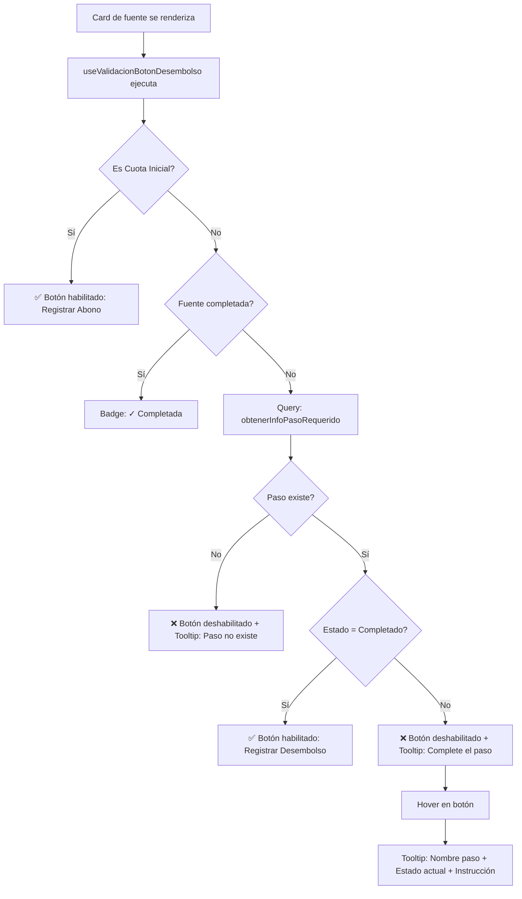
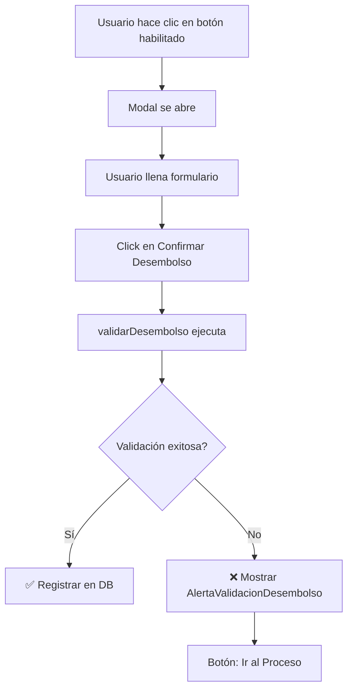

# 🔐 Validación de Desembolsos por Pasos del Proceso

## 📋 Resumen

Implementación de validación de negocio que **previene desde el inicio** el registro de desembolsos hasta que se complete el paso correspondiente en el proceso de compra del cliente.

**✨ Mejora UX**: El botón "Registrar Desembolso" se deshabilita preventivamente con tooltip explicativo, en lugar de mostrar error después de intentar registrar.

---

## 🎯 Regla de Negocio

**Antes de registrar un desembolso, el cliente debe haber completado el paso de solicitud correspondiente:**

| Fuente de Pago | Paso Requerido |
|----------------|----------------|
| **Crédito Hipotecario** | "Solicitud desembolso de Crédito hipotecario" |
| **Subsidio Caja Compensación** | "Solicitud desembolso de subsidio de caja de compensación familiar" |
| **Subsidio Mi Casa Ya** | "Solicitud desembolso de subsidio de vivienda Mi Casa Ya" |
| **Cuota Inicial** | ✅ No requiere validación (permite abonos libres) |

---

## 🏗️ Arquitectura Implementada

### 1. **Servicio de Validación**
`src/modules/abonos/services/validacion-desembolsos.service.ts`

```typescript
// Función principal (usada en modal como fallback)
validarDesembolso(negociacionId, tipoFuente) → ResultadoValidacion

// Utilidades (usadas por el botón)
obtenerInfoPasoRequerido()    // Query a DB para obtener estado del paso
requiereValidacionPaso()       // Verifica si fuente requiere paso
obtenerNombrePasoRequerido()   // Obtiene nombre del paso según fuente
```

### 2. **Hook de Validación Preventiva** ⭐ NUEVO
`src/modules/abonos/hooks/useValidacionBotonDesembolso.ts`

- Valida al cargar si el botón debe estar habilitado
- Retorna: `{ habilitado, texto, tooltipMensaje, cargando }`
- Se ejecuta automáticamente al renderizar la card

### 3. **Componente de Botón Inteligente** ⭐ NUEVO
`src/modules/abonos/components/BotonRegistrarDesembolso.tsx`

- Texto dinámico: "Registrar Abono" vs "Registrar Desembolso"
- Estados: Habilitado, Deshabilitado con tooltip, Completada, Cargando
- Tooltip con Radix UI cuando está deshabilitado

### 4. **Integración en Hook del Modal** (Validación Fallback)
`src/modules/abonos/components/modal-registrar-abono/useModalRegistrarAbono.ts`

- Validación antes de enviar formulario (por si acaso)
- Estado de validación: `validacionDesembolso`
- Handler de limpieza: `limpiarValidacion()`

### 5. **Componente de Alerta**
`src/modules/abonos/components/modal-registrar-abono/AlertaValidacionDesembolso.tsx`

- Mensaje claro del error (fallback si se bypasea validación del botón)
- Información del paso (nombre + estado)
- Botón "Ir al Proceso de Compra" con navegación directa

---

## 🔄 Flujo de Validación

### Enfoque Preventivo (Principal)



### Validación Fallback (Modal)



---

## 📁 Archivos Modificados

### ✨ Nuevos Archivos (6):

1. **`validacion-desembolsos.service.ts`** (174 líneas)
   - Servicio principal de validación
   - Mapeo de fuentes → pasos requeridos
   - Query a `procesos_negociacion`

2. **`useValidacionBotonDesembolso.ts`** ⭐ (134 líneas)
   - Hook de validación preventiva
   - Se ejecuta al renderizar card
   - Retorna estado del botón + tooltip

3. **`BotonRegistrarDesembolso.tsx`** ⭐ (104 líneas)
   - Componente de botón inteligente
   - Maneja 4 estados: Habilitado, Deshabilitado, Completada, Cargando
   - Tooltip con Radix UI

4. **`tooltip.tsx`** ⭐ (40 líneas)
   - Componente UI de tooltip con Radix
   - Reutilizable en toda la app

5. **`AlertaValidacionDesembolso.tsx`** (96 líneas)
   - Componente visual de alerta (fallback)
   - Información del paso requerido
   - Botón con navegación al proceso

6. **`VALIDACION-DESEMBOLSOS-POR-PASOS.md`** (Esta documentación)

### 🔧 Archivos Modificados (5):

7. **`useModalRegistrarAbono.ts`**
   - Import de `validarDesembolso`
   - Estado: `validacionDesembolso`
   - Validación en `handleSubmit()` (fallback)
   - Handler: `limpiarValidacion()`

8. **`modal-registrar-abono.tsx`**
   - Import de `AlertaValidacionDesembolso`
   - Prop: `clienteId`
   - Render condicional de alerta

9. **`fuente-pago-card.tsx`** ⭐
   - Reemplazado Button por `BotonRegistrarDesembolso`
   - Prop: `negociacionId`
   - Eliminada lógica condicional de habilitación

10. **`page.tsx` (Abonos)** ⭐
   - Pasar `negociacionId` a `FuentePagoCard`
   - Pasar `clienteId` a modal

11. **`hooks/index.ts`**
   - Export de `useValidacionBotonDesembolso`

---

## 🎨 Experiencia de Usuario

### Escenario 1: Cuota Inicial (Sin validación) ✅
1. Card muestra fuente "Cuota Inicial"
2. ✅ Botón **"Registrar Abono"** está **habilitado**
3. Usuario puede hacer clic y registrar abonos múltiples

### Escenario 2: Paso Completado ✅
1. Card muestra "Crédito Hipotecario"
2. El paso "Solicitud desembolso..." está **Completado**
3. ✅ Botón **"Registrar Desembolso"** está **habilitado**
4. Usuario puede hacer clic y registrar el desembolso

### Escenario 3: Paso Pendiente (UX Preventiva) ❌
1. Card muestra "Subsidio Mi Casa Ya"
2. El paso "Solicitud desembolso..." está **Pendiente**
3. ❌ Botón **"Registrar Desembolso"** está **deshabilitado** (opacidad 60%)
4. Usuario hace **hover** sobre el botón
5. 💡 Aparece **tooltip**:

```
┌──────────────────────────────────────────────────┐
│ ⚠️ Paso del Proceso Requerido                    │
│                                                   │
│ Complete el paso "Solicitud desembolso de        │
│ subsidio de vivienda Mi Casa Ya" (actualmente:   │
│ Pendiente) en el proceso de compra para          │
│ habilitar el registro de desembolso.             │
│                                                   │
│ 💡 Complete el paso en el Proceso de Compra      │
│    del cliente                                    │
└──────────────────────────────────────────────────┘
```

6. Usuario sabe exactamente **qué hacer** para habilitar el botón
7. Puede ir al proceso del cliente → completar el paso → volver

### Escenario 4: Fuente Completada 🎉
1. Fuente tiene saldo_pendiente = 0
2. ✅ Badge verde **"✓ Completada"** en lugar del botón
3. No permite más abonos

### Escenario 5: Paso No Existe (Error de Configuración) ⚠️
1. El paso requerido no está en el proceso
2. ❌ Botón deshabilitado con tooltip:
   "El paso '...' no existe en el proceso de esta negociación. Contacte al administrador."

---

## 🧪 Testing

### ✅ Casos de Prueba:

1. **Cuota Inicial**: No debe validar, permite abono directamente
2. **Crédito - Completado**: Permite desembolso
3. **Crédito - Pendiente**: Bloquea con alerta + link a proceso
4. **Subsidio Caja - En Proceso**: Bloquea con alerta
5. **Mi Casa Ya - Omitido**: Bloquea (omitido ≠ completado)
6. **Paso no existe**: Muestra error claro
7. **Navegación**: Botón redirige correctamente al proceso
8. **Limpieza**: Al cerrar alerta, se puede reintentar

### 🔍 Validación de Nombres:

Los nombres de pasos están tomados exactamente de la configuración:
```typescript
const PASOS_REQUERIDOS_POR_FUENTE = {
  'Crédito Hipotecario': 'Solicitud desembolso de Crédito hipotecario',
  'Subsidio Caja Compensación': 'Solicitud desembolso de subsidio de caja de compensación familiar',
  'Subsidio Mi Casa Ya': 'Solicitud desembolso de subsidio de vivienda Mi Casa Ya',
}
```

⚠️ **IMPORTANTE**: Si los nombres de pasos en las plantillas son diferentes, actualizar el mapeo.

---

## 🔗 Integración con Sistema de Procesos

### Flujo Completo:

1. **Cliente inicia negociación** → Se crea instancia de proceso desde plantilla
2. **Comercial completa pasos** → Actualiza estado en `procesos_negociacion`
3. **Usuario registra abono** → Validación consulta tabla `procesos_negociacion`
4. **Validación exitosa** → Permite registrar en `abonos_historial`

### Query de Validación:

```sql
SELECT id, nombre, estado, fecha_completado
FROM procesos_negociacion
WHERE negociacion_id = :negociacionId
  AND nombre = :nombrePasoRequerido
```

---

## 📊 Impacto en el Sistema

### Beneficios:

✅ **Consistencia de Datos**: Evita desembolsos sin solicitudes previas
✅ **Auditoría**: Trazabilidad del proceso completo
✅ **Cumplimiento**: Asegura seguimiento de requisitos legales
✅ **UX Mejorada**: Mensaje claro + acceso directo al proceso
✅ **Prevención de Errores**: Bloqueo preventivo vs. corrección reactiva

### Consideraciones:

⚠️ **Nombres exactos**: Validación depende de nombres idénticos en plantillas
⚠️ **Proceso activo**: Requiere que existe proceso para la negociación
⚠️ **Configuración**: Nuevas fuentes de pago necesitan actualizar el mapeo

---

## 🚀 Próximas Mejoras

- [ ] Cache de validaciones para reducir queries
- [ ] Tooltip preventivo en botón "Registrar Abono"
- [ ] Badge en fuente de pago indicando si requiere validación
- [ ] Configuración de mapeo en base de datos (no hardcoded)
- [ ] Webhook para notificar cuando paso se completa
- [ ] Auto-redirigir al completar el paso requerido

---

## 📚 Referencias

- **Servicio**: `src/modules/abonos/services/validacion-desembolsos.service.ts`
- **Componente**: `src/modules/abonos/components/modal-registrar-abono/AlertaValidacionDesembolso.tsx`
- **Hook**: `src/modules/abonos/components/modal-registrar-abono/useModalRegistrarAbono.ts`
- **Schema DB**: `docs/DATABASE-SCHEMA-REFERENCE-ACTUALIZADO.md`
- **Tipos de Proceso**: `src/modules/admin/procesos/types/index.ts`

---

**Fecha de implementación**: Noviembre 2025
**Versión**: 1.0.0
**Módulo**: Abonos + Procesos (Integración)
