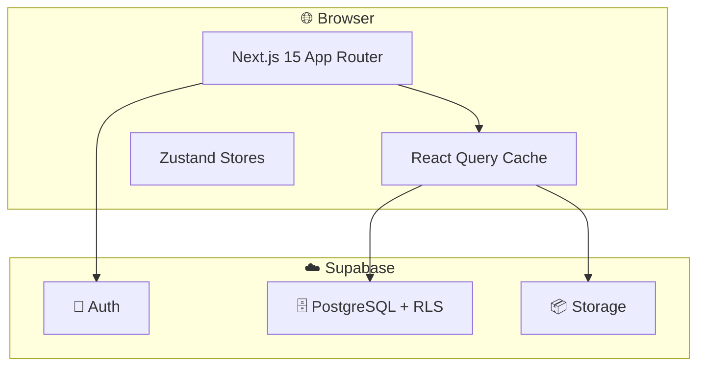

# 🏛️ Arquitectura General

> Visión de alto nivel del sistema RyR Constructora

---

## Relaciones

- Describe → [[RyR Constructora]]
- Implementa → [[Stack Tecnológico]]
- Organiza → [[Patrón de Módulos]]
- Define → [[Capas de la Aplicación]]
- Aplica → [[Separación de Responsabilidades]]

---

## Diagrama

---

## Principios

1. **Domain-Driven Design** → Módulos por dominio de negocio
2. **[[Separación de Responsabilidades]]** → UI / Lógica / Datos estricta
3. **Type Safety** → [[TypeScript]] end-to-end con tipos auto-generados
4. **Theming Modular** → [[Sistema de Theming]] con colores por módulo
5. **Sanitización** → Datos validados antes de BD

#arquitectura
