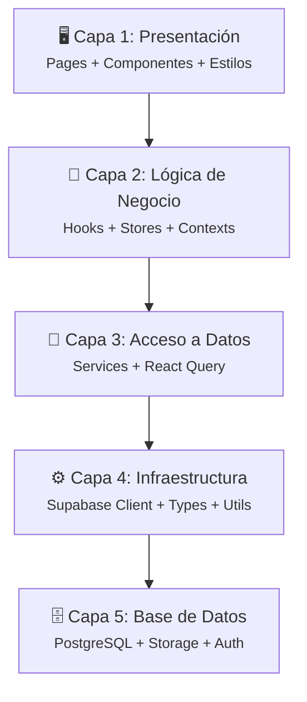

# 🏗️ Capas de la Aplicación

> 5 capas con flujo unidireccional de dependencias

---

## Relaciones

- Parte de → [[Arquitectura General]]
- Implementa → [[Separación de Responsabilidades]]
- Usa → [[React Query]], [[Zustand Stores]], [[Supabase]]

---

## Las 5 Capas

### Capa 1: Presentación
- `src/app/*/page.tsx` → Páginas Next.js
- Componentes `.tsx` < 150 líneas (UI pura)
- Estilos `.styles.ts` con [[Tailwind CSS]]
- Animaciones con Framer Motion

### Capa 2: Lógica de Negocio
- Hooks `use*.ts` → Estado y lógica
- [[Zustand Stores]] → Estado global
- Contexts → [[Autenticación]], formularios

### Capa 3: Acceso a Datos
- Services `*.service.ts` → CRUD
- [[React Query]] → Cache y sincronización

### Capa 4: Infraestructura
- [[Supabase]] client (browser/server/admin)
- [[TypeScript]] tipos auto-generados
- Utils (fechas, sanitización)

### Capa 5: [[Base de Datos]]
- PostgreSQL con RLS
- [[Storage]] para archivos
- [[Autenticación]] (Supabase Auth)

#arquitectura #capas
