# 🏗️ RyR Constructora - Diagrama de Arquitectura

## 1. Arquitectura General del Sistema

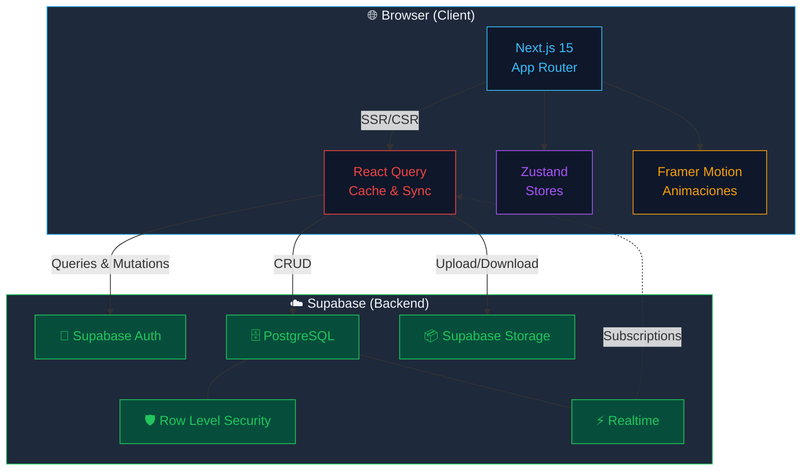

---

## 2. Stack Tecnológico

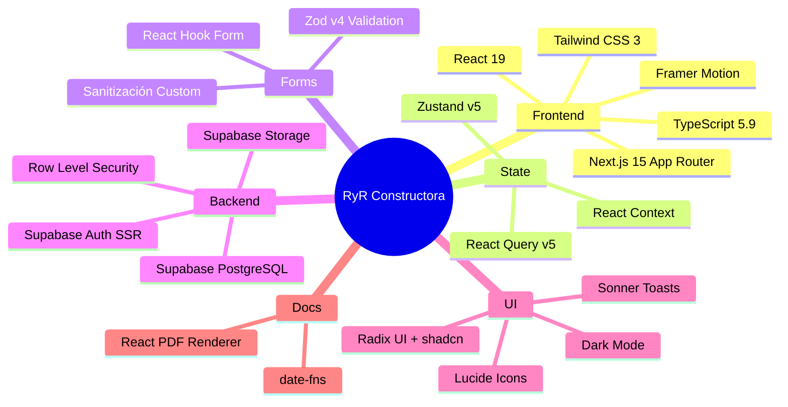

---

## 3. Módulos del Sistema (Domain-Driven Design)

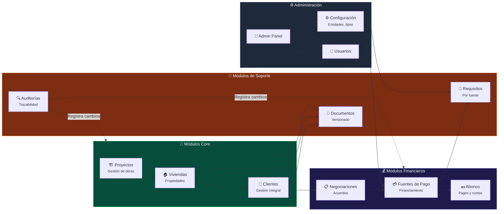

---

## 4. Estructura Interna de un Módulo (Patrón Estándar)

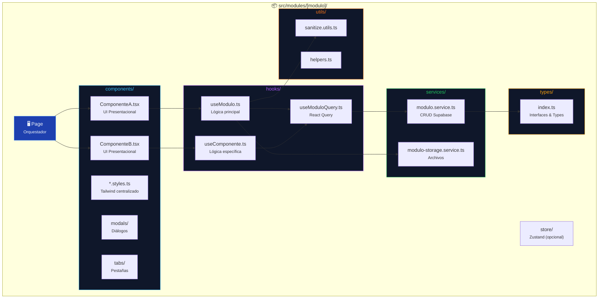

---

## 5. Flujo de Autenticación

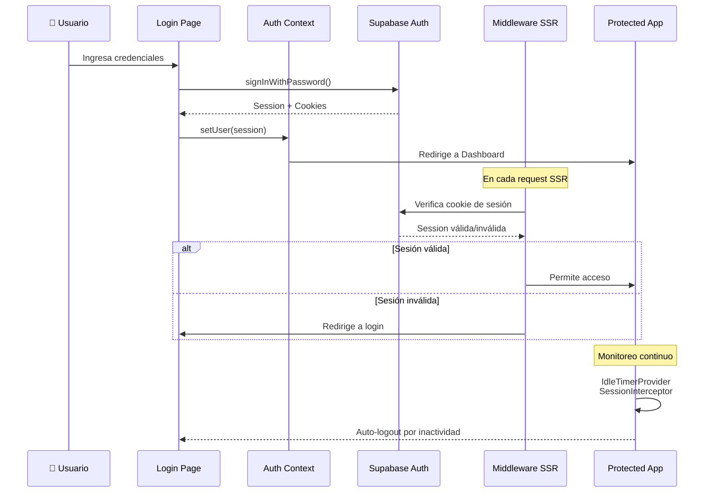

---

## 6. Flujo de Datos (CRUD típico)

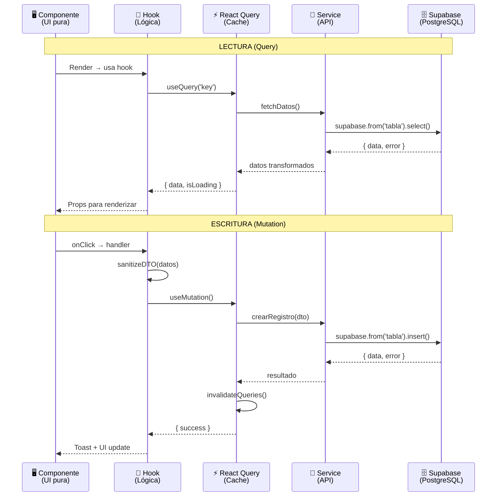

---

## 7. Rutas de la Aplicación (App Router)

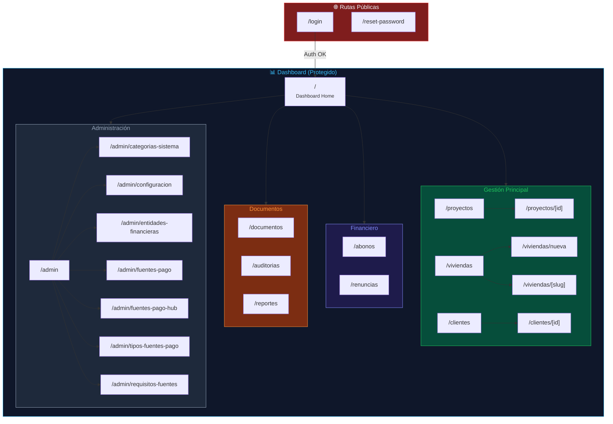

---

## 8. Sistema de Documentos

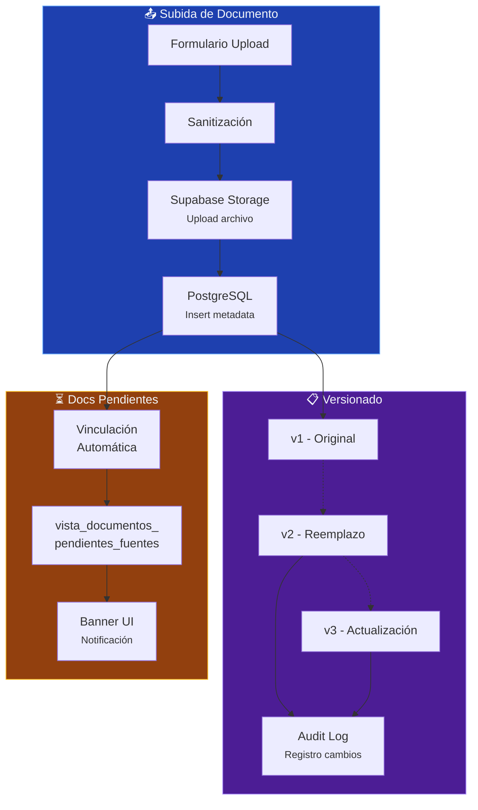

---

## 9. Sistema de Theming Modular

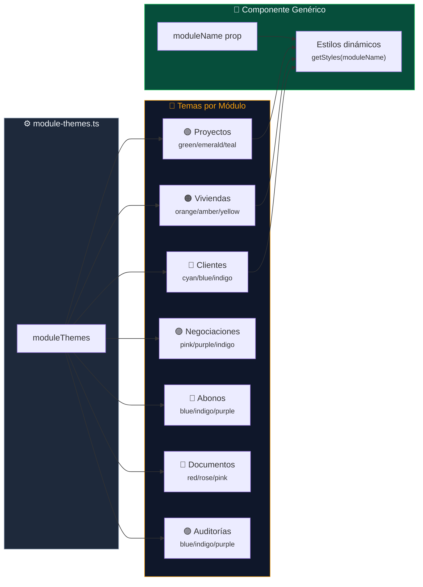

---

## 10. Esquema de Base de Datos (Entidades Principales)

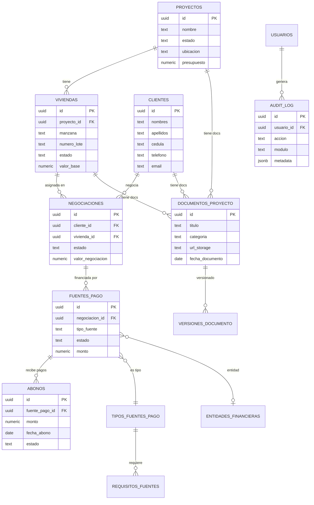

---

## 11. Flujo de Negociación Completo

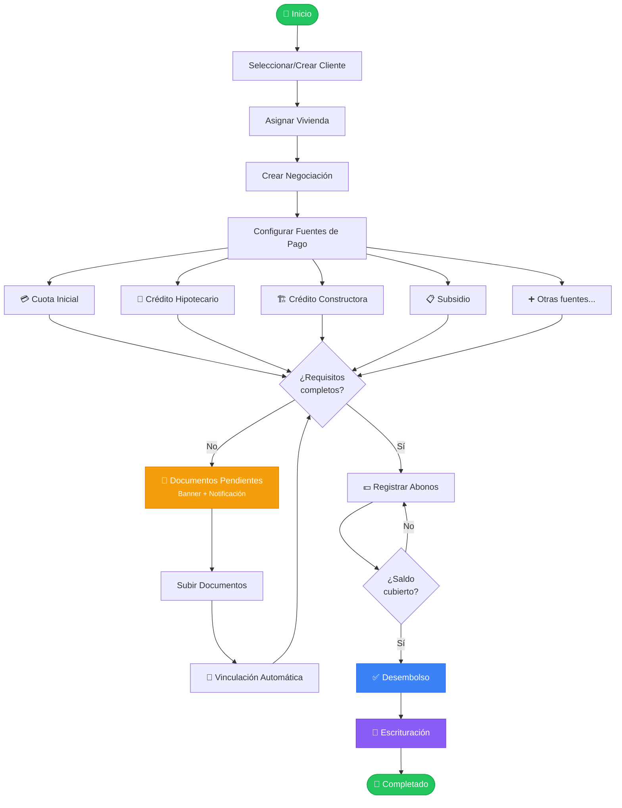

---

## 12. Capas de la Aplicación

```mermaid
graph TB
    subgraph L1["Capa 1: Presentación"]
        Pages["Pages<br/><small>src/app/*/page.tsx</small>"]
        Components["Componentes<br/><small>*.tsx < 150 líneas</small>"]
        Styles["Estilos<br/><small>*.styles.ts</small>"]
    end

    subgraph L2["Capa 2: Lógica de Negocio"]
        Hooks2["Hooks<br/><small>use*.ts</small>"]
        Stores2["Stores<br/><small>Zustand</small>"]
        Contexts2["Contexts<br/><small>Auth, UnsavedChanges</small>"]
    end

    subgraph L3["Capa 3: Acceso a Datos"]
        Services3["Services<br/><small>*.service.ts</small>"]
        ReactQuery3["React Query<br/><small>Cache + Sync</small>"]
    end

    subgraph L4["Capa 4: Infraestructura"]
        SupaClient["Supabase Client<br/><small>client.ts / server.ts</small>"]
        TypesGen["Types Generados<br/><small>database.types.ts</small>"]
        Utils4["Utilidades<br/><small>date, sanitize, etc.</small>"]
    end

    subgraph L5["Capa 5: Base de Datos"]
        PG["PostgreSQL<br/><small>Tablas + Vistas + RLS</small>"]
        SStorage["Storage<br/><small>Buckets de archivos</small>"]
        SAuth["Auth<br/><small>Usuarios + Sesiones</small>"]
    end

    L1 --> L2
    L2 --> L3
    L3 --> L4
    L4 --> L5

    style L1 fill:#1e40af,stroke:#3b82f6,color:#f1f5f9
    style L2 fill:#6d28d9,stroke:#8b5cf6,color:#f1f5f9
    style L3 fill:#047857,stroke:#10b981,color:#f1f5f9
    style L4 fill:#92400e,stroke:#f59e0b,color:#f1f5f9
    style L5 fill:#1e293b,stroke:#64748b,color:#f1f5f9
```

---

## 13. Recursos Compartidos

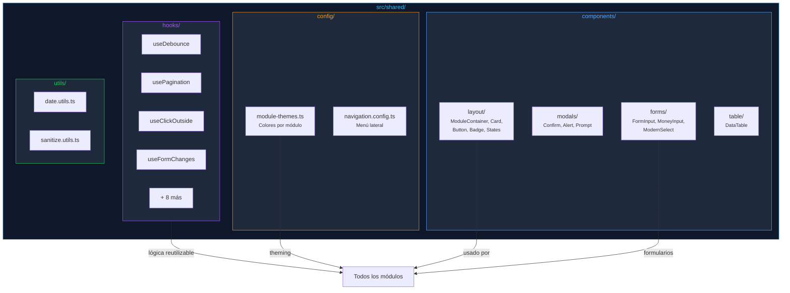

---

## 📌 Notas

- **Obsidian**: Todos los diagramas usan `mermaid` y se renderizan nativamente en Obsidian
- **Patrón DDD**: Cada módulo encapsula componentes, hooks, services, types y utils
- **Separación estricta**: UI (< 150 líneas) → Hooks (lógica) → Services (DB) → Types
- **43+ servicios** distribuidos en 12 módulos
- **Theming dinámico** con `moduleThemes[moduleName]` en componentes compartidos
- **Tipos auto-generados** desde el schema real de Supabase con `npm run types:generate`
