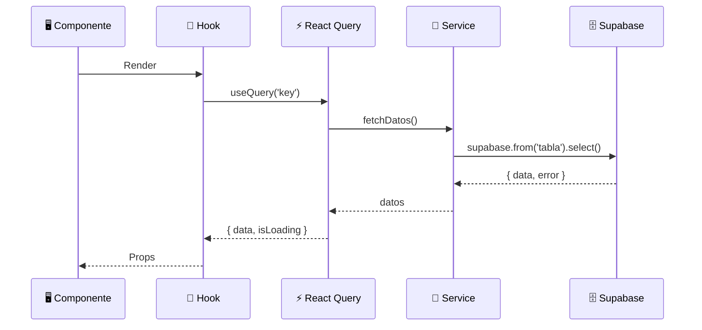
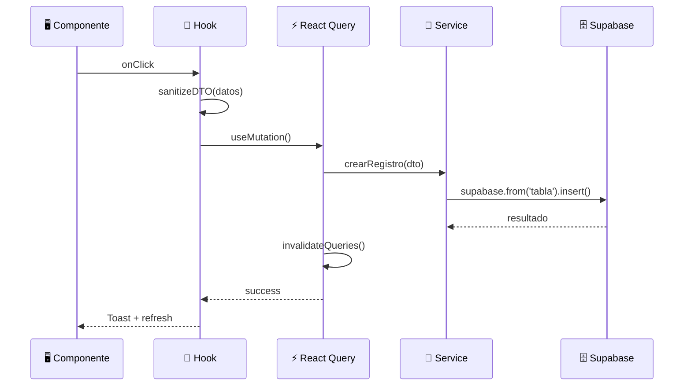

# 🔁 Flujo CRUD

> Patrón estándar de lectura/escritura en todos los módulos

---

## Relaciones

- Patrón usado por → Todos los módulos de [[RyR Constructora]]
- Implementa → [[Separación de Responsabilidades]]
- Usa → [[React Query]], [[Supabase]]
- Define → [[Capas de la Aplicación]]

---

## Lectura (Query)

## Escritura (Mutation)

---

## Capas involucradas

1. **Componente** → Solo renderiza y captura eventos
2. **Hook** → Sanitiza, orquesta query/mutation
3. **[[React Query]]** → Cache, invalidación, retry
4. **Service** → Llamada directa a [[Supabase]]
5. **[[Base de Datos]]** → PostgreSQL + RLS

#flujo #crud
