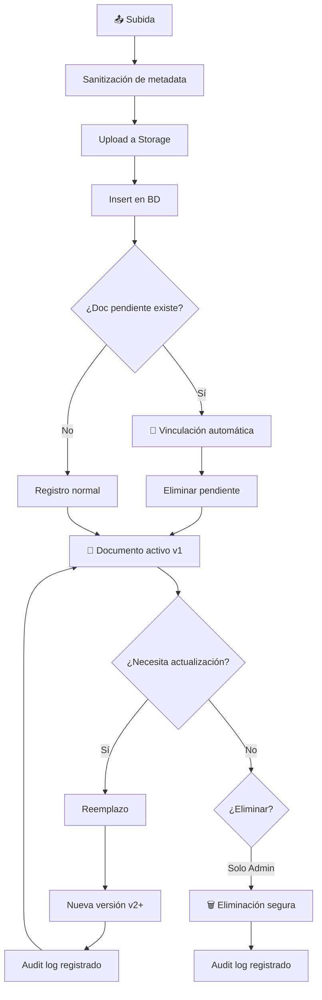

# 📄 Flujo de Documentos

> Ciclo de vida completo de un documento en el sistema

---

## Relaciones

- Parte de → [[RyR Constructora]]
- Módulo → [[Documentos]]
- Almacenado en → [[Storage]]
- Trazado en → [[Auditorías]]

---

## Ciclo de Vida

---

## Componentes Clave

- **Documentos pendientes**: Vista SQL calcula en tiempo real
- **Versionado**: Historial completo de cada documento
- **Reemplazo**: Modal genérico con [[Sistema de Theming]]
- **Eliminación**: Solo desde [[Admin Panel]]
- **Auditoría**: Toda acción queda en [[Auditorías]]

#flujo #documentos
