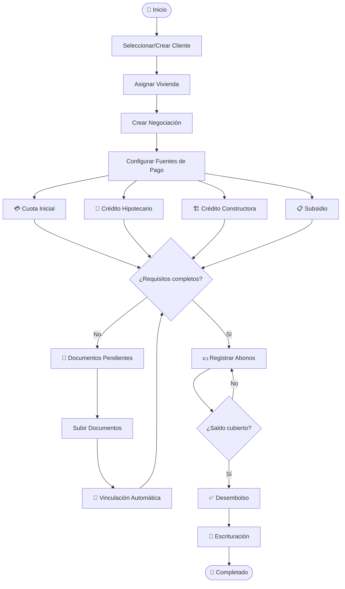

# 🔄 Flujo de Negociación

> Proceso completo desde selección de cliente hasta escrituración

---

## Relaciones

- Proceso principal de → [[RyR Constructora]]
- Involucra → [[Clientes]], [[Viviendas]], [[Negociaciones]]
- Financiado por → [[Fuentes de Pago]]
- Pagos via → [[Abonos]]
- Documentación → [[Documentos]], [[Requisitos de Fuentes]]

---

## Pasos del Flujo

---

## Detalle por Paso

### 1. [[Clientes|Seleccionar Cliente]]
- Buscar existente o crear nuevo
- Datos personales sanitizados

### 2. [[Viviendas|Asignar Vivienda]]
- Seleccionar de viviendas disponibles en [[Proyectos]]
- Vivienda cambia estado a "Asignada"

### 3. [[Negociaciones|Crear Negociación]]
- Vincula cliente + vivienda
- Define valor de negociación

### 4. [[Fuentes de Pago|Configurar Financiamiento]]
- Fuentes cargadas dinámicamente desde BD
- Cada fuente con monto y entidad financiera

### 5. [[Requisitos de Fuentes|Verificar Requisitos]]
- Cada fuente tiene requisitos documentales
- Sistema no bloquea si faltan docs

### 6. [[Documentos|Documentación]]
- Banner de pendientes en UI
- Vinculación automática por metadata
- Documentos específicos y compartidos

### 7. [[Abonos|Registrar Pagos]]
- Pagos por fuente de pago
- Comprobantes en [[Storage]]

### 8. Desembolso y Escrituración
- Validación de condiciones
- Cierre de la negociación

#flujo #negociación
